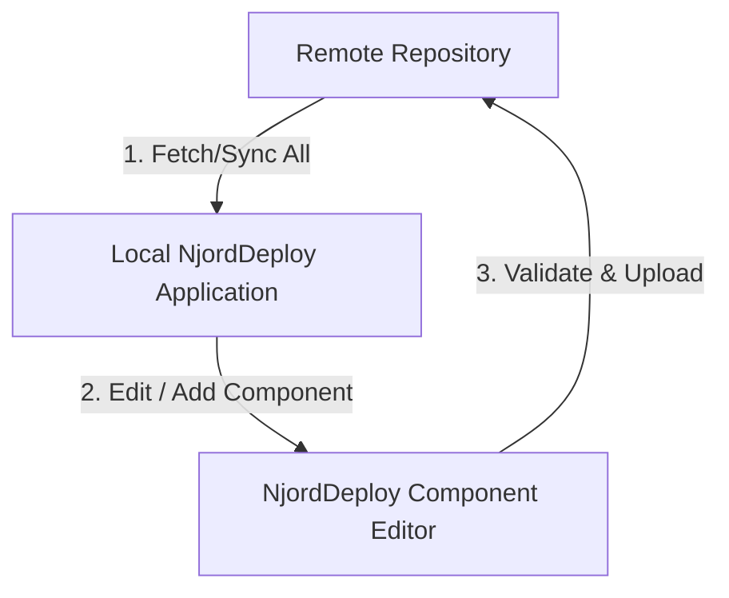

# NjordDeploy Components Repository

This repository serves as the central directory for all Docker Compose templates and metadata definitions used by the NjordDeploy platform.

## Architecture & Workflow

The NjordDeploy ecosystem operates on a two-way synchronization model:



### 1. Developer Role (Write Access)
- The developer uses the **NjordDeploy Component Editor** to create or modify components.
- The editor has a built-in **Git Authorization Check** to verify push permissions. Only authorized developers with write permissions (either via SSH keys or Personal Access Tokens) can push updates.
- If additional contributors are added, they must be granted write access to this repository on GitHub.
- When an authorized developer triggers the upload action, the editor performs a pre-flight metadata validation check on the template header before pushing changes.

### 2. End-User Role (Read Access / Sync)
- Regular users run the NjordDeploy application locally.
- Regular users fetch and import the latest component metadata and templates from this repository directly into their local environment.
- End-users do not need write permissions; they only read the public definitions.

## Component File Standards

All template files (e.g., `docker-compose.template.yml`) must start with the following uniform metadata header:

```yaml
# status: "untested"
# last_tested_version: "none"
# platform_notes: "None"
# breaking_changes: "None"
```

- **status**: Can be `untested`, `testing`, `tested`, or `deprecated`.
- **platform_notes**: Specifically notes platform details (for example, "Targeted for ARM architecture." if the container runs on Raspberry Pi architecture).

## Component Governance & Admission Policy

To prevent a proliferation of rarely or never used components ("wildgroei"), the following governance policy is strictly enforced:
1. **Product Owner Approval:** Only components explicitly approved by the Product Owner will be admitted to the official repository.
2. **Admission Criteria:** Components must represent popular, active, and highly-requested self-hosted services that fit the Raspberry Pi/SBC ecosystem.
3. **Quality & Testing:** Any new or modified component must pass all static syntax validation and a full Proxmox integration test (marked as `status: "tested"`) before admission.
4. **Contribution Workflow:** External developers must submit updates or new components via GitHub Pull Requests (PRs). Direct pushing to the `main` branch is restricted to the Product Owner.

## Contributing

1. Clone this repository or edit via the **NjordDeploy Component Editor**.
2. Add your component and write standard docker compose templates.
3. Validate templates using the linter within the Component Editor before pushing.

### AI-Assisted Bootstrapping
To quickly add new components, you can use the **AI-Assisted Component Generator** ("Create with AI") in the Component Editor. By specifying a GitHub repository URL, the editor automatically fetches the `README.md` and any `docker-compose.yml` files from the repository, using Google Gemini to automatically generate and pre-validate the metadata, variables, and Docker Compose template.
