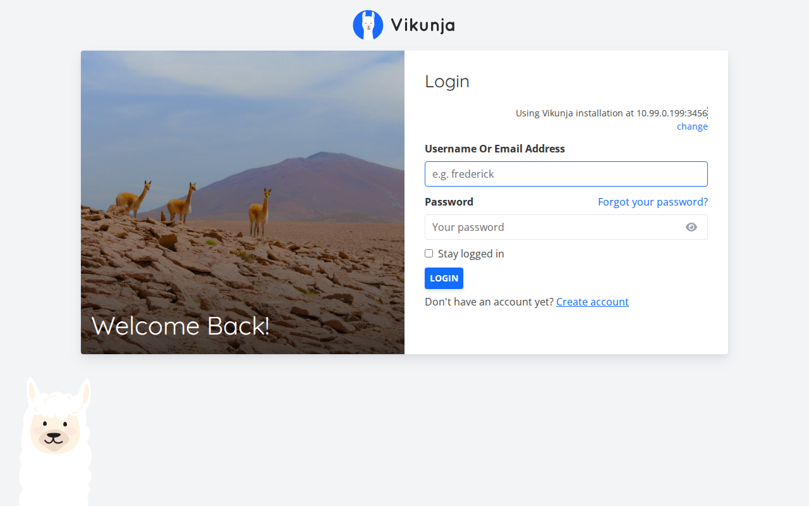
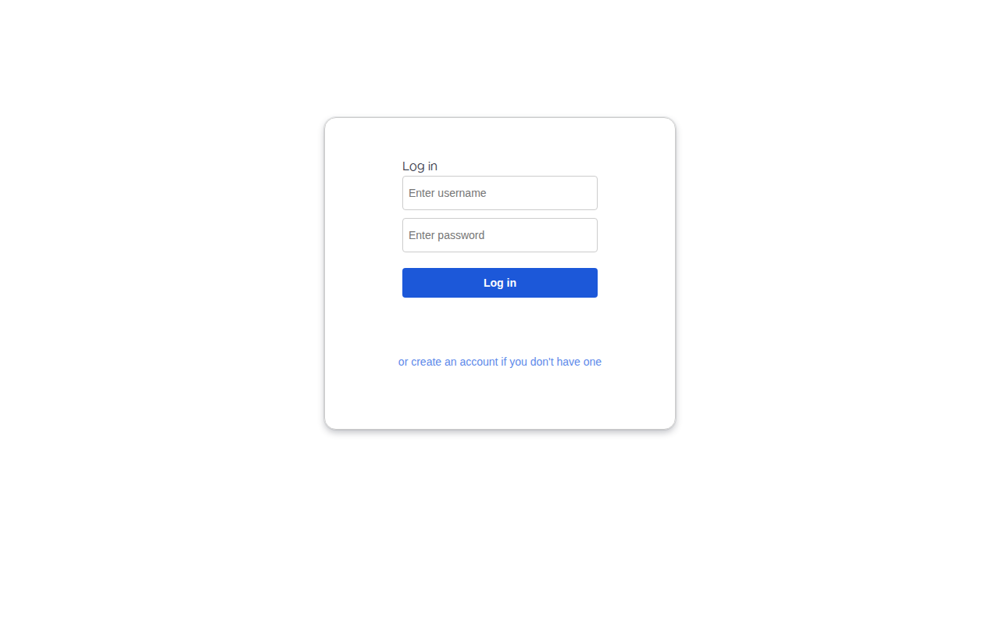
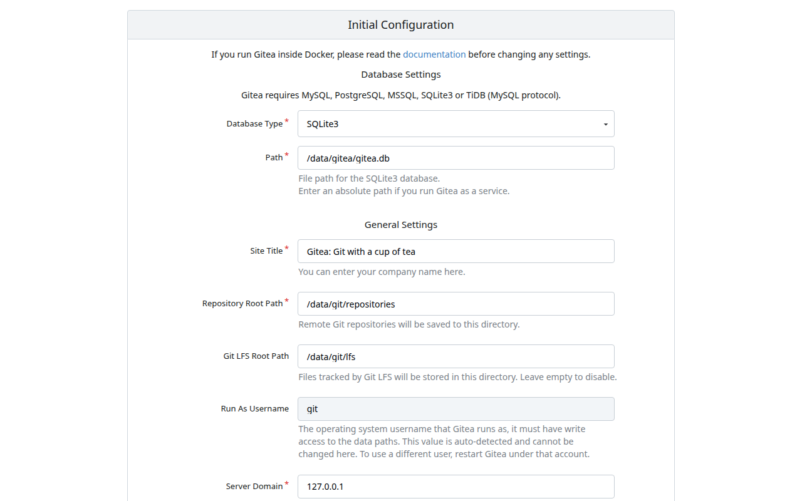
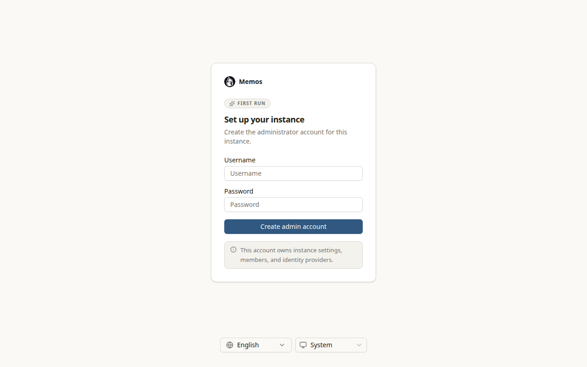

# 📦 Stack Verification Report: Agile Operations & Secure Chat

> **Stack ID:** `agile-ops` | **Status:** ✅ PASSED | **Last Verified:** 2026-09-13 10:32:55

## Overview & Purpose

Agile project execution and encrypted collaboration workstation bundling Vikunja task management, Focalboard Kanban sprint boards, Gitea code repository & CI/CD, Conduit lightweight Matrix homeserver, and Memos private notes.

### Test Environment & Parameters
- **Hypervisor / Platform:** Proxmox VE 8.x
- **Execution Target:** `VM` (PODMAN)
- **Host Bridge / Network:** Isolated Subnet (`10.99.0.x`)
- **Services in Stack:** 5 modular containers

## Stack Services Matrix

| Service / Component | Status | Container | HTTP / Web UI | Log Validation | Details |
| :--- | :--- | :--- | :--- | :--- | :--- |
| **Vikunja** (`vikunja`) | ✅ Ready | Running | OK | Clean (No errors) | [Inspect](#details-vikunja) |
| **Focalboard** (`focalboard`) | ✅ Ready | Running | OK | Clean (No errors) | [Inspect](#details-focalboard) |
| **Gitea** (`gitea`) | ✅ Ready | Running | OK | Clean (No errors) | [Inspect](#details-gitea) |
| **Conduit (Matrix Server)** (`conduit`) | ✅ Ready | Running | N/A | Clean (No errors) | [Inspect](#details-conduit) |
| **Memos** (`memos`) | ✅ Ready | Running | OK | Clean (No errors) | [Inspect](#details-memos) |

---

## Detailed Service Inspection & Upstream Guides

Expand each section below to inspect ports, auth protocol, and upstream project links for post-installation configuration.

<details id="details-vikunja">
<summary>🔍 <b>Component Inspection: Vikunja (<code>vikunja</code>)</b></summary>

**Description:** The to-do app to organize your life with Kanban boards, Gantt charts, lists and table views.

#### Upstream Project & Configuration Docs:
- 💡 **Post-Install Guide:** *Open Vikunja web UI and complete the initial onboarding setup.*

#### Deployment Runtime Parameters:
- **Port Bindings:** `Host/Standard`
- **Web UI Endpoint:** `http://10.99.0.199:3456`
- **Onboarding / Auth Protocol:** `wizard`
- **Volume Mapping:** Isolated Persistent Storage (`/opt/njorddeploy/vikunja`)

#### Web UI Screenshot:



```yaml
# NjordDeploy verified configuration preview for vikunja
service: vikunja
status: healthy
restart_policy: unless-stopped
```
</details>

<details id="details-focalboard">
<summary>🔍 <b>Component Inspection: Focalboard (<code>focalboard</code>)</b></summary>

**Description:** Open source, multilingual project management and personal task board alternative to Trello, Notion, and Asana.

#### Upstream Project & Configuration Docs:
- 💡 **Post-Install Guide:** *Open Focalboard web UI and complete the initial onboarding setup.*

#### Deployment Runtime Parameters:
- **Port Bindings:** `Host/Standard`
- **Web UI Endpoint:** `http://10.99.0.199:8099`
- **Onboarding / Auth Protocol:** `wizard`
- **Volume Mapping:** Isolated Persistent Storage (`/opt/njorddeploy/focalboard`)

#### Web UI Screenshot:



```yaml
# NjordDeploy verified configuration preview for focalboard
service: focalboard
status: healthy
restart_policy: unless-stopped
```
</details>

<details id="details-gitea">
<summary>🔍 <b>Component Inspection: Gitea (<code>gitea</code>)</b></summary>

**Description:** A painless, self-hosted Git service written in Go with repository management, code review, issues, and wikis.

#### Upstream Project & Configuration Docs:
- 📖 **Configuration Manual:** [https://docs.gitea.com/installation/install-with-docker](https://docs.gitea.com/installation/install-with-docker)
- 💡 **Post-Install Guide:** *Review database settings and register the initial administrator account at the bottom of the installation page.*

#### Deployment Runtime Parameters:
- **Port Bindings:** `Host/Standard`
- **Web UI Endpoint:** `http://10.99.0.199:3000`
- **Onboarding / Auth Protocol:** `wizard`
- **Volume Mapping:** Isolated Persistent Storage (`/opt/njorddeploy/gitea`)

#### Web UI Screenshot:



```yaml
# NjordDeploy verified configuration preview for gitea
service: gitea
status: healthy
restart_policy: unless-stopped
```
</details>

<details id="details-conduit">
<summary>🔍 <b>Component Inspection: Conduit (Matrix Server) (<code>conduit</code>)</b></summary>

**Description:** A high-performance, lightweight Matrix chat homeserver written in Rust, specifically optimized for low-resource environments like the Raspberry Pi.

#### Upstream Project & Configuration Docs:
- 🌐 **Official Website / Repo:** [https://conduit.rs/](https://conduit.rs/)
- 💡 **Post-Install Guide:** *Background service operating without an independent web interface.*

#### Deployment Runtime Parameters:
- **Port Bindings:** `Host/Standard`
- **Web UI Endpoint:** `Configured dynamically`
- **Onboarding / Auth Protocol:** `none`
- **Volume Mapping:** Isolated Persistent Storage (`/opt/njorddeploy/conduit`)

```yaml
# NjordDeploy verified configuration preview for conduit
service: conduit
status: healthy
restart_policy: unless-stopped
```
</details>

<details id="details-memos">
<summary>🔍 <b>Component Inspection: Memos (<code>memos</code>)</b></summary>

**Description:** A privacy-first, lightweight note-taking service with markdown support and social timeline view.

#### Upstream Project & Configuration Docs:
- 💡 **Post-Install Guide:** *Open Memos web UI and complete the initial onboarding setup.*

#### Deployment Runtime Parameters:
- **Port Bindings:** `Host/Standard`
- **Web UI Endpoint:** `http://10.99.0.199:5230`
- **Onboarding / Auth Protocol:** `wizard`
- **Volume Mapping:** Isolated Persistent Storage (`/opt/njorddeploy/memos`)

#### Web UI Screenshot:



```yaml
# NjordDeploy verified configuration preview for memos
service: memos
status: healthy
restart_policy: unless-stopped
```
</details>

---

## 🖼️ Verified Web UI Screenshots Gallery

The following live screenshots were automatically captured during the test run:

### Vikunja (`vikunja`)
- **Endpoint:** [http://10.99.0.199:3456](http://10.99.0.199:3456)


### Focalboard (`focalboard`)
- **Endpoint:** [http://10.99.0.199:8099](http://10.99.0.199:8099)


### Gitea (`gitea`)
- **Endpoint:** [http://10.99.0.199:3000](http://10.99.0.199:3000)


### Memos (`memos`)
- **Endpoint:** [http://10.99.0.199:5230](http://10.99.0.199:5230)


---
[⬅️ Back to Master Test Dashboard](../LATEST_RUN.md)
