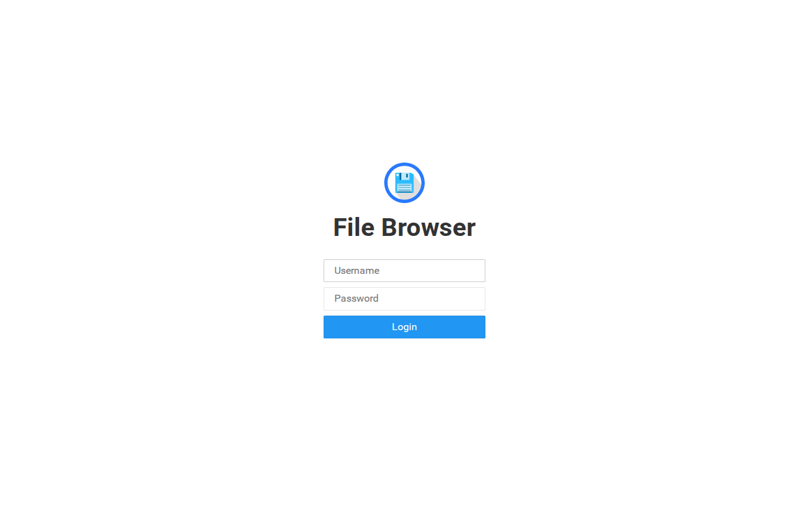

# 📦 Stack Verification Report: Reverse Proxy & Remote Workspace

> **Stack ID:** `caddy-filebrowser-stack` | **Status:** ✅ PASSED | **Last Verified:** 2026-09-13 10:34:24

## Overview & Purpose

Caddy automated HTTPS reverse proxy paired with FileBrowser for instant web-based file and configuration management.

### Test Environment & Parameters
- **Hypervisor / Platform:** Proxmox VE 8.x
- **Execution Target:** `VM` (PODMAN)
- **Host Bridge / Network:** Isolated Subnet (`10.99.0.x`)
- **Services in Stack:** 2 modular containers

## Stack Services Matrix

| Service / Component | Status | Container | HTTP / Web UI | Log Validation | Details |
| :--- | :--- | :--- | :--- | :--- | :--- |
| **Caddy** (`caddy`) | ✅ Ready | Running | OK | Clean (No errors) | [Inspect](#details-caddy) |
| **Filebrowser** (`filebrowser`) | ✅ Ready | Running | OK | Clean (No errors) | [Inspect](#details-filebrowser) |

---

## Detailed Service Inspection & Upstream Guides

Expand each section below to inspect ports, auth protocol, and upstream project links for post-installation configuration.

<details id="details-caddy">
<summary>🔍 <b>Component Inspection: Caddy (<code>caddy</code>)</b></summary>

**Description:** Caddy is a powerful, enterprise-ready, open source web server with automatic HTTPS written in Go.

#### Upstream Project & Configuration Docs:
- 🌐 **Official Website / Repo:** [https://github.com/caddyserver/caddy](https://github.com/caddyserver/caddy)
- 💡 **Post-Install Guide:** *Open Caddy web UI and complete the initial onboarding setup.*

#### Deployment Runtime Parameters:
- **Port Bindings:** `Host/Standard`
- **Web UI Endpoint:** `http://10.99.0.199:80`
- **Onboarding / Auth Protocol:** `wizard`
- **Volume Mapping:** Isolated Persistent Storage (`/opt/njorddeploy/caddy`)

#### Web UI Screenshot:


```yaml
# NjordDeploy verified configuration preview for caddy
service: caddy
status: healthy
restart_policy: unless-stopped
```
</details>

<details id="details-filebrowser">
<summary>🔍 <b>Component Inspection: Filebrowser (<code>filebrowser</code>)</b></summary>

**Description:** A lightweight web-based file manager allowing users to upload, edit, delete, preview, and share files on server storage volumes.

#### Upstream Project & Configuration Docs:
- 🌐 **Official Website / Repo:** [https://filebrowser.org/](https://filebrowser.org/)
- 📖 **Configuration Manual:** [https://filebrowser.org/quick-start](https://filebrowser.org/quick-start)
- 💡 **Post-Install Guide:** *Sign in with initial credentials 'admin' / 'admin' and change the password immediately under Settings.*

#### Deployment Runtime Parameters:
- **Port Bindings:** `Host/Standard`
- **Web UI Endpoint:** `http://10.99.0.199:8080`
- **Onboarding / Auth Protocol:** `preconfigured`
- **Volume Mapping:** Isolated Persistent Storage (`/opt/njorddeploy/filebrowser`)

#### Web UI Screenshot:



```yaml
# NjordDeploy verified configuration preview for filebrowser
service: filebrowser
status: healthy
restart_policy: unless-stopped
```
</details>

---

## 🖼️ Verified Web UI Screenshots Gallery

The following live screenshots were automatically captured during the test run:

### Caddy (`caddy`)
- **Endpoint:** [http://10.99.0.199:80](http://10.99.0.199:80)


### Filebrowser (`filebrowser`)
- **Endpoint:** [http://10.99.0.199:8080](http://10.99.0.199:8080)


---
[⬅️ Back to Master Test Dashboard](../LATEST_RUN.md)
