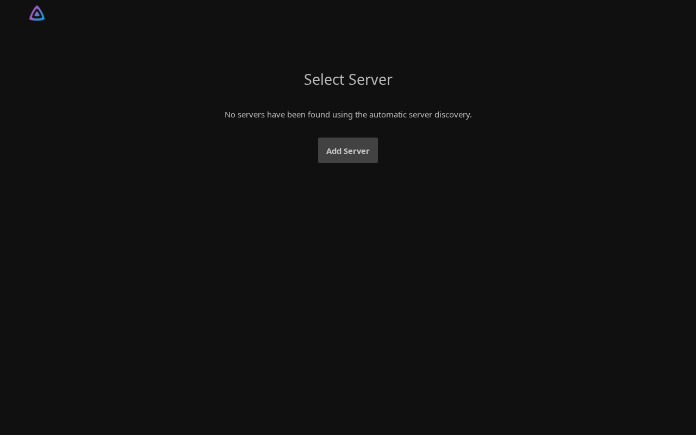
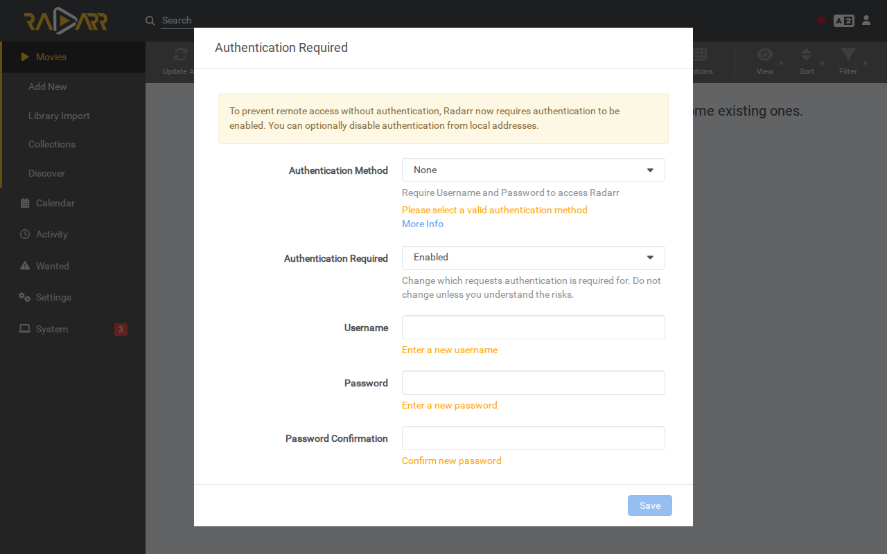
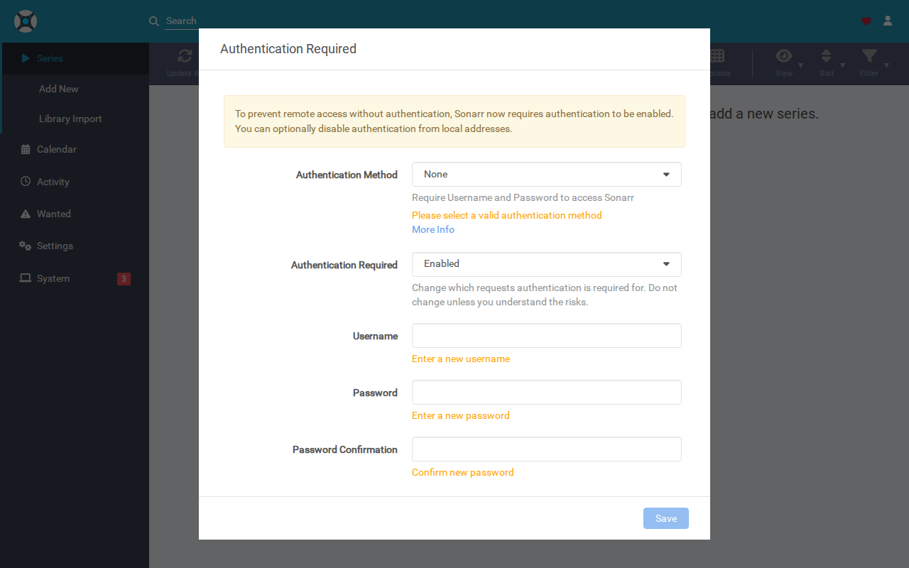
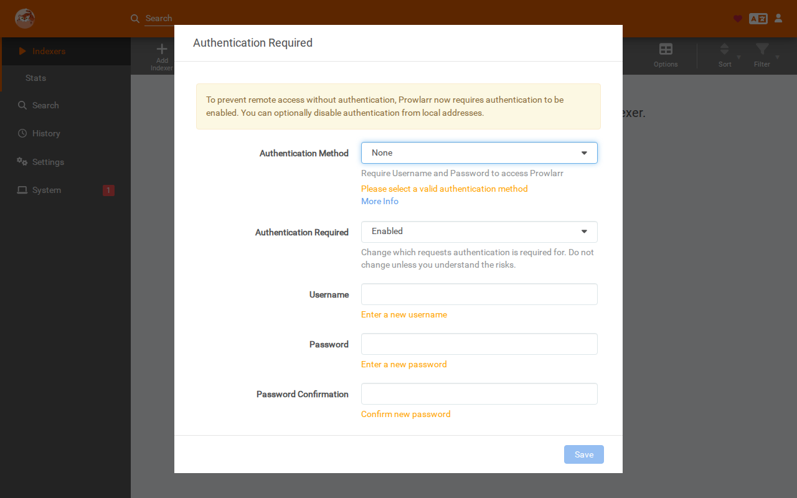
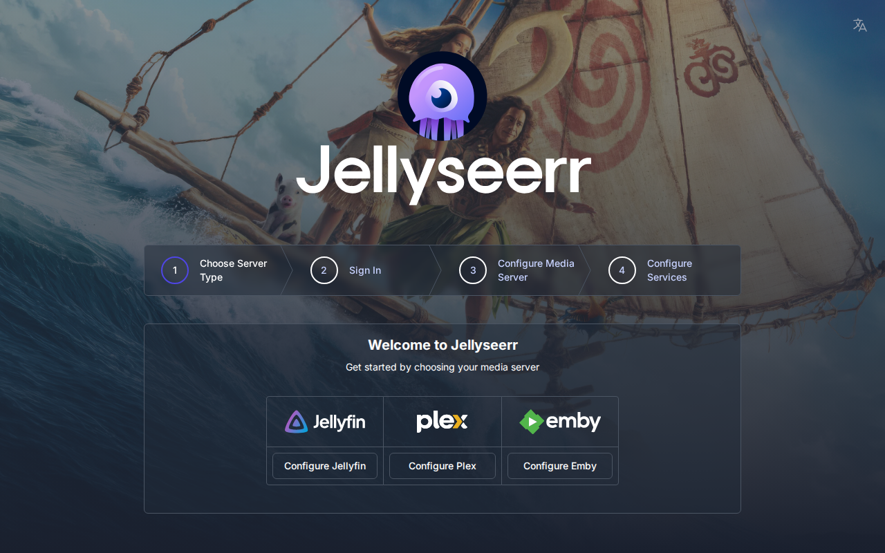
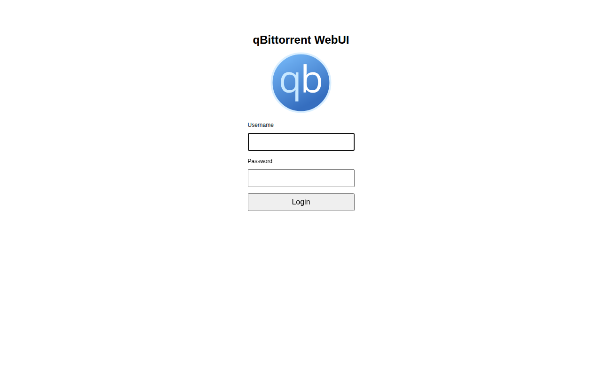
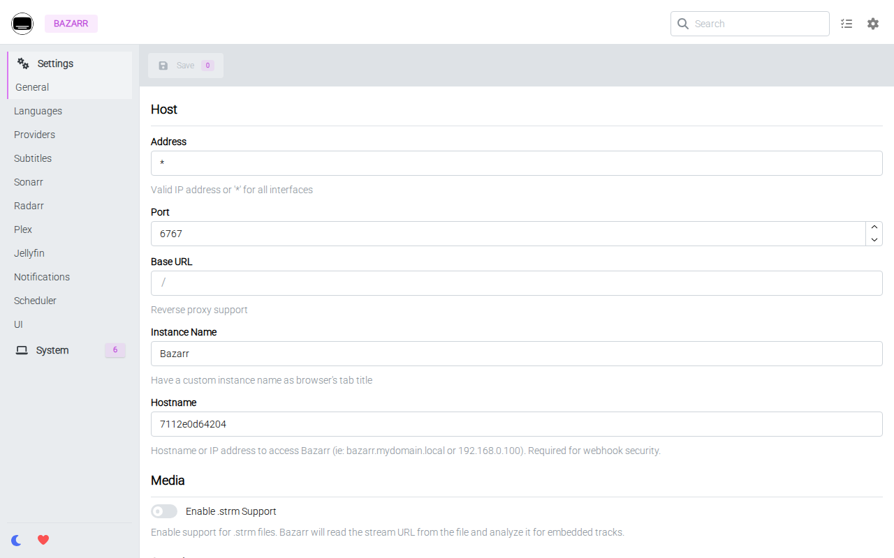

# 📦 Stack Verification Report: Media Streaming & Servarr Suite

> **Stack ID:** `media-stack` | **Status:** ✅ PASSED | **Last Verified:** 2026-09-13 10:43:06

## Overview & Purpose

Unified sovereign media streaming pipeline bundling Jellyfin media server, Radarr (movies), Sonarr (TV shows), Prowlarr (indexer proxy), Jellyseerr (requests), qBittorrent, and Bazarr (subtitles).

### Test Environment & Parameters
- **Hypervisor / Platform:** Proxmox VE 8.x
- **Execution Target:** `VM` (PODMAN)
- **Host Bridge / Network:** Isolated Subnet (`10.99.0.x`)
- **Services in Stack:** 7 modular containers

## Stack Services Matrix

| Service / Component | Status | Container | HTTP / Web UI | Log Validation | Details |
| :--- | :--- | :--- | :--- | :--- | :--- |
| **Jellyfin** (`jellyfin`) | ✅ Ready | Running | OK | Clean (No errors) | [Inspect](#details-jellyfin) |
| **Radarr** (`radarr`) | ✅ Ready | Running | OK | Clean (No errors) | [Inspect](#details-radarr) |
| **Sonarr** (`sonarr`) | ✅ Ready | Running | OK | Clean (No errors) | [Inspect](#details-sonarr) |
| **Prowlarr** (`prowlarr`) | ✅ Ready | Running | OK | Clean (No errors) | [Inspect](#details-prowlarr) |
| **Jellyseerr** (`jellyseerr`) | ✅ Ready | Running | OK | Clean (No errors) | [Inspect](#details-jellyseerr) |
| **qBittorrent** (`qbittorrent`) | ✅ Ready | Running | OK | Clean (No errors) | [Inspect](#details-qbittorrent) |
| **Bazarr** (`bazarr`) | ✅ Ready | Running | OK | Clean (No errors) | [Inspect](#details-bazarr) |

---

## Detailed Service Inspection & Upstream Guides

Expand each section below to inspect ports, auth protocol, and upstream project links for post-installation configuration.

<details id="details-jellyfin">
<summary>🔍 <b>Component Inspection: Jellyfin (<code>jellyfin</code>)</b></summary>

**Description:** A Free Software Media System that puts you in control of your media.

#### Upstream Project & Configuration Docs:
- 🌐 **Official Website / Repo:** [https://jellyfin.org/](https://jellyfin.org/)
- 💡 **Post-Install Guide:** *Open Jellyfin web UI and complete the initial onboarding setup.*

#### Deployment Runtime Parameters:
- **Port Bindings:** `Host/Standard`
- **Web UI Endpoint:** `http://10.99.0.199:8096`
- **Onboarding / Auth Protocol:** `wizard`
- **Volume Mapping:** Isolated Persistent Storage (`/opt/njorddeploy/jellyfin`)

#### Web UI Screenshot:



```yaml
# NjordDeploy verified configuration preview for jellyfin
service: jellyfin
status: healthy
restart_policy: unless-stopped
```
</details>

<details id="details-radarr">
<summary>🔍 <b>Component Inspection: Radarr (<code>radarr</code>)</b></summary>

**Description:** An automated movie collection manager and PVR that monitors RSS feeds for new releases, triggers download clients, and automatically organizes media files.

#### Upstream Project & Configuration Docs:
- 🌐 **Official Website / Repo:** [https://radarr.video/](https://radarr.video/)
- 💡 **Post-Install Guide:** *Open Radarr web UI and complete the initial onboarding setup.*

#### Deployment Runtime Parameters:
- **Port Bindings:** `Host/Standard`
- **Web UI Endpoint:** `http://10.99.0.199:7878`
- **Onboarding / Auth Protocol:** `wizard`
- **Volume Mapping:** Isolated Persistent Storage (`/opt/njorddeploy/radarr`)

#### Web UI Screenshot:



```yaml
# NjordDeploy verified configuration preview for radarr
service: radarr
status: healthy
restart_policy: unless-stopped
```
</details>

<details id="details-sonarr">
<summary>🔍 <b>Component Inspection: Sonarr (<code>sonarr</code>)</b></summary>

**Description:** An automated TV series collection manager and PVR that tracks upcoming episodes, triggers downloads via Usenet or BitTorrent, and organizes show libraries.

#### Upstream Project & Configuration Docs:
- 🌐 **Official Website / Repo:** [https://sonarr.tv/](https://sonarr.tv/)
- 💡 **Post-Install Guide:** *Open Sonarr web UI and complete the initial onboarding setup.*

#### Deployment Runtime Parameters:
- **Port Bindings:** `Host/Standard`
- **Web UI Endpoint:** `http://10.99.0.199:8989`
- **Onboarding / Auth Protocol:** `wizard`
- **Volume Mapping:** Isolated Persistent Storage (`/opt/njorddeploy/sonarr`)

#### Web UI Screenshot:



```yaml
# NjordDeploy verified configuration preview for sonarr
service: sonarr
status: healthy
restart_policy: unless-stopped
```
</details>

<details id="details-prowlarr">
<summary>🔍 <b>Component Inspection: Prowlarr (<code>prowlarr</code>)</b></summary>

**Description:** Prowlarr is an indexer manager/proxy built on the popular *arr .net/reactjs base stack to integrate with your various PVR apps. Prowlarr supports management of both Torrent Trackers and Usenet Indexers.

#### Upstream Project & Configuration Docs:
- 🌐 **Official Website / Repo:** [https://prowlarr.com/](https://prowlarr.com/)
- 💡 **Post-Install Guide:** *Open Prowlarr web UI and complete the initial onboarding setup.*

#### Deployment Runtime Parameters:
- **Port Bindings:** `Host/Standard`
- **Web UI Endpoint:** `http://10.99.0.199:9696`
- **Onboarding / Auth Protocol:** `wizard`
- **Volume Mapping:** Isolated Persistent Storage (`/opt/njorddeploy/prowlarr`)

#### Web UI Screenshot:



```yaml
# NjordDeploy verified configuration preview for prowlarr
service: prowlarr
status: healthy
restart_policy: unless-stopped
```
</details>

<details id="details-jellyseerr">
<summary>🔍 <b>Component Inspection: Jellyseerr (<code>jellyseerr</code>)</b></summary>

**Description:** Free and open source software application for managing requests for your media library (Jellyfin, Emby, Plex).

#### Upstream Project & Configuration Docs:
- 💡 **Post-Install Guide:** *Open Jellyseerr web UI and complete the initial onboarding setup.*

#### Deployment Runtime Parameters:
- **Port Bindings:** `Host/Standard`
- **Web UI Endpoint:** `http://10.99.0.199:5055`
- **Onboarding / Auth Protocol:** `wizard`
- **Volume Mapping:** Isolated Persistent Storage (`/opt/njorddeploy/jellyseerr`)

#### Web UI Screenshot:



```yaml
# NjordDeploy verified configuration preview for jellyseerr
service: jellyseerr
status: healthy
restart_policy: unless-stopped
```
</details>

<details id="details-qbittorrent">
<summary>🔍 <b>Component Inspection: qBittorrent (<code>qbittorrent</code>)</b></summary>

**Description:** A lightweight, open-source BitTorrent download client featuring a full-featured web interface, bandwidth scheduling, and built-in search engines.

#### Upstream Project & Configuration Docs:
- 🌐 **Official Website / Repo:** [https://www.qbittorrent.org/](https://www.qbittorrent.org/)
- 💡 **Post-Install Guide:** *Open qBittorrent web UI and complete the initial onboarding setup.*

#### Deployment Runtime Parameters:
- **Port Bindings:** `Host/Standard`
- **Web UI Endpoint:** `http://10.99.0.199:8084`
- **Onboarding / Auth Protocol:** `wizard`
- **Volume Mapping:** Isolated Persistent Storage (`/opt/njorddeploy/qbittorrent`)

#### Web UI Screenshot:



```yaml
# NjordDeploy verified configuration preview for qbittorrent
service: qbittorrent
status: healthy
restart_policy: unless-stopped
```
</details>

<details id="details-bazarr">
<summary>🔍 <b>Component Inspection: Bazarr (<code>bazarr</code>)</b></summary>

**Description:** Companion application to Sonarr and Radarr that manages and downloads subtitles based on your requirements.

#### Upstream Project & Configuration Docs:
- 💡 **Post-Install Guide:** *Open Bazarr web UI and complete the initial onboarding setup.*

#### Deployment Runtime Parameters:
- **Port Bindings:** `Host/Standard`
- **Web UI Endpoint:** `http://10.99.0.199:6767`
- **Onboarding / Auth Protocol:** `wizard`
- **Volume Mapping:** Isolated Persistent Storage (`/opt/njorddeploy/bazarr`)

#### Web UI Screenshot:



```yaml
# NjordDeploy verified configuration preview for bazarr
service: bazarr
status: healthy
restart_policy: unless-stopped
```
</details>

---

## 🖼️ Verified Web UI Screenshots Gallery

The following live screenshots were automatically captured during the test run:

### Jellyfin (`jellyfin`)
- **Endpoint:** [http://10.99.0.199:8096](http://10.99.0.199:8096)


### Radarr (`radarr`)
- **Endpoint:** [http://10.99.0.199:7878](http://10.99.0.199:7878)


### Sonarr (`sonarr`)
- **Endpoint:** [http://10.99.0.199:8989](http://10.99.0.199:8989)


### Prowlarr (`prowlarr`)
- **Endpoint:** [http://10.99.0.199:9696](http://10.99.0.199:9696)


### Jellyseerr (`jellyseerr`)
- **Endpoint:** [http://10.99.0.199:5055](http://10.99.0.199:5055)


### qBittorrent (`qbittorrent`)
- **Endpoint:** [http://10.99.0.199:8084](http://10.99.0.199:8084)


### Bazarr (`bazarr`)
- **Endpoint:** [http://10.99.0.199:6767](http://10.99.0.199:6767)


---
[⬅️ Back to Master Test Dashboard](../LATEST_RUN.md)
