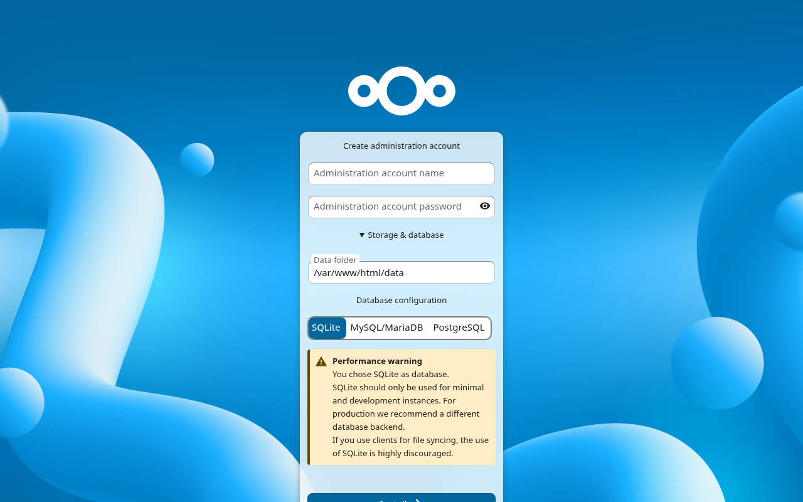
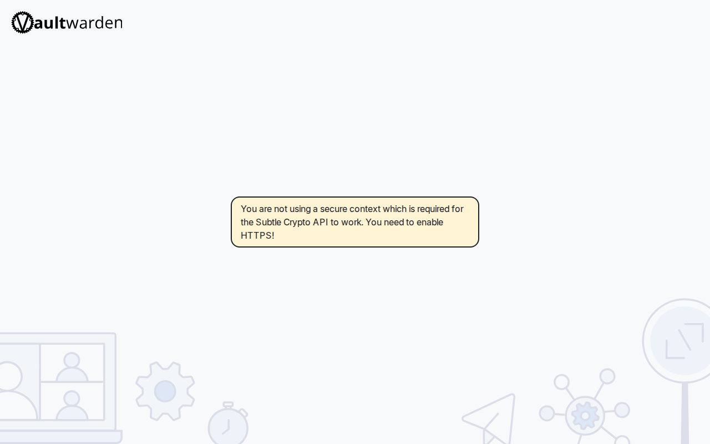

# 📦 Stack Verification Report: The Modern Sovereign Workplace

> **Stack ID:** `modern-workplace` | **Status:** ✅ PASSED | **Last Verified:** 2026-09-13 10:45:49

## Overview & Purpose

Turnkey Microsoft 365 & Google Workspace alternative bundling enterprise Nextcloud Hub, dedicated MariaDB, Redis cache, automated database dumper, high-performance push notifications, and Vaultwarden centralized password management.

### Test Environment & Parameters
- **Hypervisor / Platform:** Proxmox VE 8.x
- **Execution Target:** `VM` (PODMAN)
- **Host Bridge / Network:** Isolated Subnet (`10.99.0.x`)
- **Services in Stack:** 6 modular containers

## Stack Services Matrix

| Service / Component | Status | Container | HTTP / Web UI | Log Validation | Details |
| :--- | :--- | :--- | :--- | :--- | :--- |
| **Nextcloud** (`nextcloud`) | ✅ Ready | Running | OK | Clean (No errors) | [Inspect](#details-nextcloud) |
| **Nextcloud MariaDB** (`nextcloud-db`) | ✅ Ready | Running | N/A | Clean (No errors) | [Inspect](#details-nextcloud-db) |
| **Nextcloud Redis Cache** (`nextcloud-redis`) | ✅ Ready | Running | N/A | Clean (No errors) | [Inspect](#details-nextcloud-redis) |
| **Nextcloud DB Dumper** (`nextcloud-db-dumper`) | ✅ Ready | Running | N/A | Clean (No errors) | [Inspect](#details-nextcloud-db-dumper) |
| **Nextcloud High-Performance Push** (`notify-push`) | ✅ Ready | Running | N/A | Clean (No errors) | [Inspect](#details-notify-push) |
| **Vaultwarden** (`vaultwarden`) | ✅ Ready | Running | OK | Clean (No errors) | [Inspect](#details-vaultwarden) |

---

## Detailed Service Inspection & Upstream Guides

Expand each section below to inspect ports, auth protocol, and upstream project links for post-installation configuration.

<details id="details-nextcloud">
<summary>🔍 <b>Component Inspection: Nextcloud (<code>nextcloud</code>)</b></summary>

**Description:** A comprehensive self-hosted productivity and collaboration suite offering secure file storage, online document editing, calendar, and contacts synchronization.

#### Upstream Project & Configuration Docs:
- 🌐 **Official Website / Repo:** [https://nextcloud.com/](https://nextcloud.com/)
- 📖 **Configuration Manual:** [https://docs.nextcloud.com/](https://docs.nextcloud.com/)
- 💡 **Post-Install Guide:** *Enter your desired administrator credentials on the initial setup page to initialize the Nextcloud instance.*

#### Deployment Runtime Parameters:
- **Port Bindings:** `Host/Standard`
- **Web UI Endpoint:** `http://10.99.0.199:8080`
- **Onboarding / Auth Protocol:** `wizard`
- **Volume Mapping:** Isolated Persistent Storage (`/opt/njorddeploy/nextcloud`)

#### Web UI Screenshot:



```yaml
# NjordDeploy verified configuration preview for nextcloud
service: nextcloud
status: healthy
restart_policy: unless-stopped
```
</details>

<details id="details-nextcloud-db">
<summary>🔍 <b>Component Inspection: Nextcloud MariaDB (<code>nextcloud-db</code>)</b></summary>

**Description:** A dedicated, pre-configured MariaDB relational database server optimized for Nextcloud persistent data storage and high query performance.

#### Upstream Project & Configuration Docs:
- 💡 **Post-Install Guide:** *Background service operating without an independent web interface.*

#### Deployment Runtime Parameters:
- **Port Bindings:** `Host/Standard`
- **Web UI Endpoint:** `Configured dynamically`
- **Onboarding / Auth Protocol:** `none`
- **Volume Mapping:** Isolated Persistent Storage (`/opt/njorddeploy/nextcloud-db`)

```yaml
# NjordDeploy verified configuration preview for nextcloud-db
service: nextcloud-db
status: healthy
restart_policy: unless-stopped
```
</details>

<details id="details-nextcloud-redis">
<summary>🔍 <b>Component Inspection: Nextcloud Redis Cache (<code>nextcloud-redis</code>)</b></summary>

**Description:** An in-memory Redis datastore configured as a high-performance transactional file locking broker and caching layer for Nextcloud.

#### Upstream Project & Configuration Docs:
- 💡 **Post-Install Guide:** *Background service operating without an independent web interface.*

#### Deployment Runtime Parameters:
- **Port Bindings:** `Host/Standard`
- **Web UI Endpoint:** `Configured dynamically`
- **Onboarding / Auth Protocol:** `none`
- **Volume Mapping:** Isolated Persistent Storage (`/opt/njorddeploy/nextcloud-redis`)

```yaml
# NjordDeploy verified configuration preview for nextcloud-redis
service: nextcloud-redis
status: healthy
restart_policy: unless-stopped
```
</details>

<details id="details-nextcloud-db-dumper">
<summary>🔍 <b>Component Inspection: Nextcloud DB Dumper (<code>nextcloud-db-dumper</code>)</b></summary>

**Description:** An automated backup utility container that periodically exports SQL dumps of the Nextcloud MariaDB database for disaster recovery.

#### Upstream Project & Configuration Docs:
- 💡 **Post-Install Guide:** *Background service operating without an independent web interface.*

#### Deployment Runtime Parameters:
- **Port Bindings:** `Host/Standard`
- **Web UI Endpoint:** `Configured dynamically`
- **Onboarding / Auth Protocol:** `none`
- **Volume Mapping:** Isolated Persistent Storage (`/opt/njorddeploy/nextcloud-db-dumper`)

```yaml
# NjordDeploy verified configuration preview for nextcloud-db-dumper
service: nextcloud-db-dumper
status: healthy
restart_policy: unless-stopped
```
</details>

<details id="details-notify-push">
<summary>🔍 <b>Component Inspection: Nextcloud High-Performance Push (<code>notify-push</code>)</b></summary>

**Description:** Realtime notification and file-sync daemon for Nextcloud written in Rust.

#### Upstream Project & Configuration Docs:
- 💡 **Post-Install Guide:** *Background service operating without an independent web interface.*

#### Deployment Runtime Parameters:
- **Port Bindings:** `Host/Standard`
- **Web UI Endpoint:** `Configured dynamically`
- **Onboarding / Auth Protocol:** `none`
- **Volume Mapping:** Isolated Persistent Storage (`/opt/njorddeploy/notify-push`)

```yaml
# NjordDeploy verified configuration preview for notify-push
service: notify-push
status: healthy
restart_policy: unless-stopped
```
</details>

<details id="details-vaultwarden">
<summary>🔍 <b>Component Inspection: Vaultwarden (<code>vaultwarden</code>)</b></summary>

**Description:** A lightweight, self-hosted password manager compatible with Bitwarden clients. It provides almost all of the features of the official server without the resource-heavy footprint.

#### Upstream Project & Configuration Docs:
- 🌐 **Official Website / Repo:** [https://github.com/dani-garcia/vaultwarden](https://github.com/dani-garcia/vaultwarden)
- 📖 **Configuration Manual:** [https://github.com/dani-garcia/vaultwarden/wiki](https://github.com/dani-garcia/vaultwarden/wiki)
- 💡 **Post-Install Guide:** *Open the web vault in your browser and click 'Create Account' to establish your master credentials.*

#### Deployment Runtime Parameters:
- **Port Bindings:** `Host/Standard`
- **Web UI Endpoint:** `http://10.99.0.199:8088`
- **Onboarding / Auth Protocol:** `wizard`
- **Volume Mapping:** Isolated Persistent Storage (`/opt/njorddeploy/vaultwarden`)

#### Web UI Screenshot:



```yaml
# NjordDeploy verified configuration preview for vaultwarden
service: vaultwarden
status: healthy
restart_policy: unless-stopped
```
</details>

---

## 🖼️ Verified Web UI Screenshots Gallery

The following live screenshots were automatically captured during the test run:

### Nextcloud (`nextcloud`)
- **Endpoint:** [http://10.99.0.199:8080](http://10.99.0.199:8080)


### Vaultwarden (`vaultwarden`)
- **Endpoint:** [http://10.99.0.199:8088](http://10.99.0.199:8088)


---
[⬅️ Back to Master Test Dashboard](../LATEST_RUN.md)
