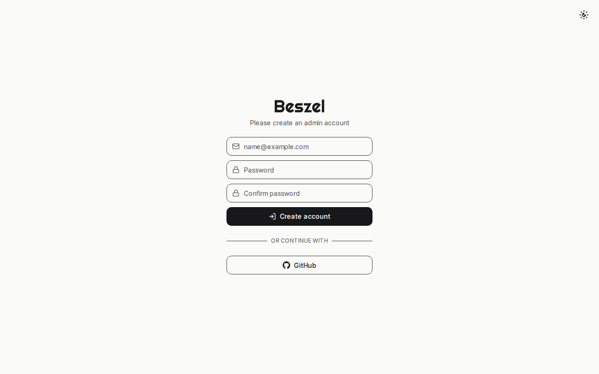
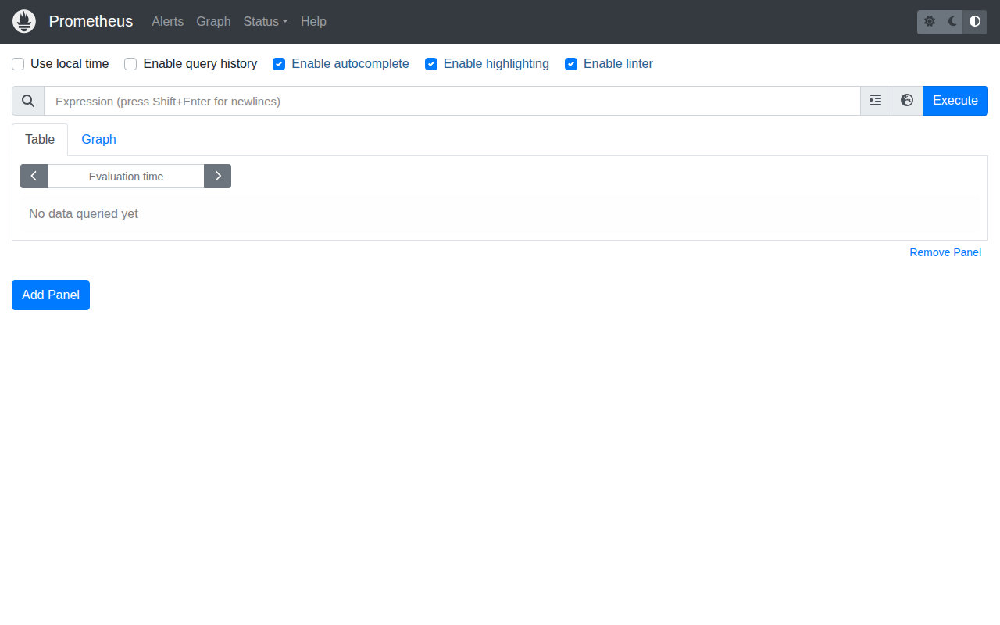
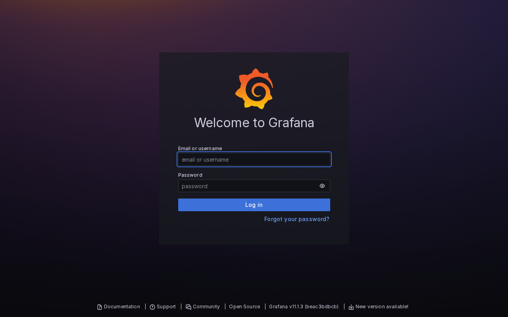
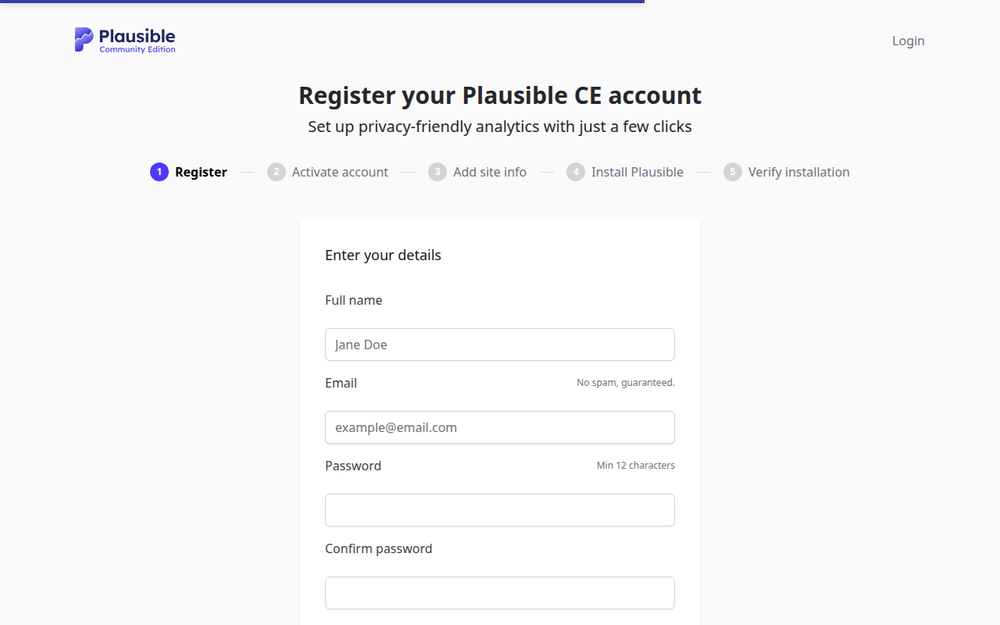
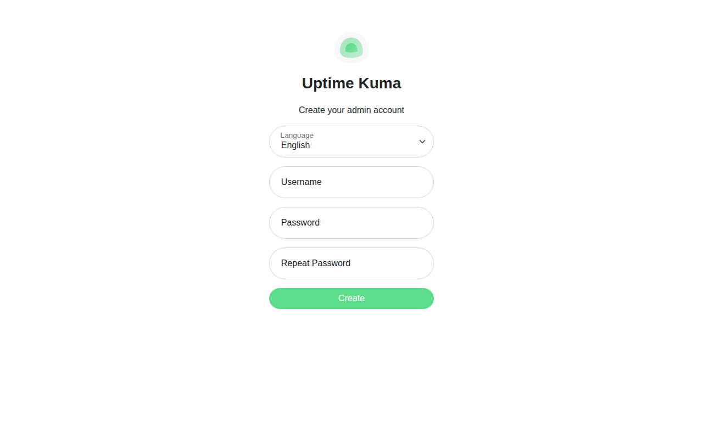

# 📦 Stack Verification Report: Observability & Privacy Analytics

> **Stack ID:** `observability-analytics` | **Status:** ✅ PASSED | **Last Verified:** 2026-09-13 10:50:36

## Overview & Purpose

Full-stack server fleet observability and GDPR-compliant website analytics bundling Beszel lightweight metrics, Prometheus time-series collector, Grafana visualization dashboards, Plausible cookie-less web analytics, and Uptime Kuma status monitors.

### Test Environment & Parameters
- **Hypervisor / Platform:** Proxmox VE 8.x
- **Execution Target:** `VM` (PODMAN)
- **Host Bridge / Network:** Isolated Subnet (`10.99.0.x`)
- **Services in Stack:** 5 modular containers

## Stack Services Matrix

| Service / Component | Status | Container | HTTP / Web UI | Log Validation | Details |
| :--- | :--- | :--- | :--- | :--- | :--- |
| **Beszel** (`beszel`) | ✅ Ready | Running | OK | Clean (No errors) | [Inspect](#details-beszel) |
| **Prometheus Stack** (`prometheus`) | ✅ Ready | Running | OK | Clean (No errors) | [Inspect](#details-prometheus) |
| **Grafana Stack** (`grafana`) | ✅ Ready | Running | OK | Clean (No errors) | [Inspect](#details-grafana) |
| **Plausible Analytics** (`plausible`) | ✅ Ready | Running | OK | Clean (No errors) | [Inspect](#details-plausible) |
| **Uptime Kuma** (`uptime-kuma`) | ✅ Ready | Running | OK | Clean (No errors) | [Inspect](#details-uptime-kuma) |

---

## Detailed Service Inspection & Upstream Guides

Expand each section below to inspect ports, auth protocol, and upstream project links for post-installation configuration.

<details id="details-beszel">
<summary>🔍 <b>Component Inspection: Beszel (<code>beszel</code>)</b></summary>

**Description:** Lightweight server monitoring hub with historical resource metrics and alerts.

#### Upstream Project & Configuration Docs:
- 💡 **Post-Install Guide:** *Open Beszel web UI and complete the initial onboarding setup.*

#### Deployment Runtime Parameters:
- **Port Bindings:** `Host/Standard`
- **Web UI Endpoint:** `http://10.99.0.199:8095`
- **Onboarding / Auth Protocol:** `wizard`
- **Volume Mapping:** Isolated Persistent Storage (`/opt/njorddeploy/beszel`)

#### Web UI Screenshot:



```yaml
# NjordDeploy verified configuration preview for beszel
service: beszel
status: healthy
restart_policy: unless-stopped
```
</details>

<details id="details-prometheus">
<summary>🔍 <b>Component Inspection: Prometheus Stack (<code>prometheus</code>)</b></summary>

**Description:** Prometheus, a Cloud Native Computing Foundation project, is a systems and service monitoring system. It collects metrics from configured targets at given intervals, evaluates rule expressions, displays the results, and can trigger alerts when specified conditions are observed. This stack includes Prometheus, Node Exporter, and cAdvisor for comprehensive system and container monitoring.

#### Upstream Project & Configuration Docs:
- 🌐 **Official Website / Repo:** [https://prometheus.io/](https://prometheus.io/)
- 💡 **Post-Install Guide:** *Open Prometheus Stack web UI and complete the initial onboarding setup.*

#### Deployment Runtime Parameters:
- **Port Bindings:** `Host/Standard`
- **Web UI Endpoint:** `http://10.99.0.199:9090`
- **Onboarding / Auth Protocol:** `wizard`
- **Volume Mapping:** Isolated Persistent Storage (`/opt/njorddeploy/prometheus`)

#### Web UI Screenshot:



```yaml
# NjordDeploy verified configuration preview for prometheus
service: prometheus
status: healthy
restart_policy: unless-stopped
```
</details>

<details id="details-grafana">
<summary>🔍 <b>Component Inspection: Grafana Stack (<code>grafana</code>)</b></summary>

**Description:** An open-source visualization and analytics platform that turns metrics and logs into dynamic, interactive dashboards for comprehensive system observability.

#### Upstream Project & Configuration Docs:
- 🌐 **Official Website / Repo:** [https://grafana.com/](https://grafana.com/)
- 📖 **Configuration Manual:** [https://grafana.com/docs/grafana/latest/getting-started/](https://grafana.com/docs/grafana/latest/getting-started/)
- 💡 **Post-Install Guide:** *Sign in as 'admin' using the password configured in GRAFANA_ADMIN_PASSWORD.*

#### Deployment Runtime Parameters:
- **Port Bindings:** `Host/Standard`
- **Web UI Endpoint:** `http://10.99.0.199:3000`
- **Onboarding / Auth Protocol:** `preconfigured`
- **Volume Mapping:** Isolated Persistent Storage (`/opt/njorddeploy/grafana`)

#### Web UI Screenshot:



```yaml
# NjordDeploy verified configuration preview for grafana
service: grafana
status: healthy
restart_policy: unless-stopped
```
</details>

<details id="details-plausible">
<summary>🔍 <b>Component Inspection: Plausible Analytics (<code>plausible</code>)</b></summary>

**Description:** Plausible is a lightweight, open-source and privacy-friendly Google Analytics alternative without cookies and fully compliant with GDPR, CCPA and PECR.

#### Upstream Project & Configuration Docs:
- 🌐 **Official Website / Repo:** [https://plausible.io/](https://plausible.io/)
- 💡 **Post-Install Guide:** *Open Plausible Analytics web UI and complete the initial onboarding setup.*

#### Deployment Runtime Parameters:
- **Port Bindings:** `Host/Standard`
- **Web UI Endpoint:** `http://10.99.0.199:8000`
- **Onboarding / Auth Protocol:** `wizard`
- **Volume Mapping:** Isolated Persistent Storage (`/opt/njorddeploy/plausible`)

#### Web UI Screenshot:



```yaml
# NjordDeploy verified configuration preview for plausible
service: plausible
status: healthy
restart_policy: unless-stopped
```
</details>

<details id="details-uptime-kuma">
<summary>🔍 <b>Component Inspection: Uptime Kuma (<code>uptime-kuma</code>)</b></summary>

**Description:** A feature-rich, self-hosted monitoring tool providing real-time status pages, HTTP/ping health checks, and alerts via multiple notification channels.

#### Upstream Project & Configuration Docs:
- 🌐 **Official Website / Repo:** [https://uptime.kuma.pet/](https://uptime.kuma.pet/)
- 📖 **Configuration Manual:** [https://github.com/louislam/uptime-kuma/wiki](https://github.com/louislam/uptime-kuma/wiki)
- 💡 **Post-Install Guide:** *Create your initial administrator username and password upon first visiting the web UI.*

#### Deployment Runtime Parameters:
- **Port Bindings:** `Host/Standard`
- **Web UI Endpoint:** `http://10.99.0.199:3001`
- **Onboarding / Auth Protocol:** `wizard`
- **Volume Mapping:** Isolated Persistent Storage (`/opt/njorddeploy/uptime-kuma`)

#### Web UI Screenshot:



```yaml
# NjordDeploy verified configuration preview for uptime-kuma
service: uptime-kuma
status: healthy
restart_policy: unless-stopped
```
</details>

---

## 🖼️ Verified Web UI Screenshots Gallery

The following live screenshots were automatically captured during the test run:

### Beszel (`beszel`)
- **Endpoint:** [http://10.99.0.199:8095](http://10.99.0.199:8095)


### Prometheus Stack (`prometheus`)
- **Endpoint:** [http://10.99.0.199:9090](http://10.99.0.199:9090)


### Grafana Stack (`grafana`)
- **Endpoint:** [http://10.99.0.199:3000](http://10.99.0.199:3000)


### Plausible Analytics (`plausible`)
- **Endpoint:** [http://10.99.0.199:8000](http://10.99.0.199:8000)


### Uptime Kuma (`uptime-kuma`)
- **Endpoint:** [http://10.99.0.199:3001](http://10.99.0.199:3001)


---
[⬅️ Back to Master Test Dashboard](../LATEST_RUN.md)
