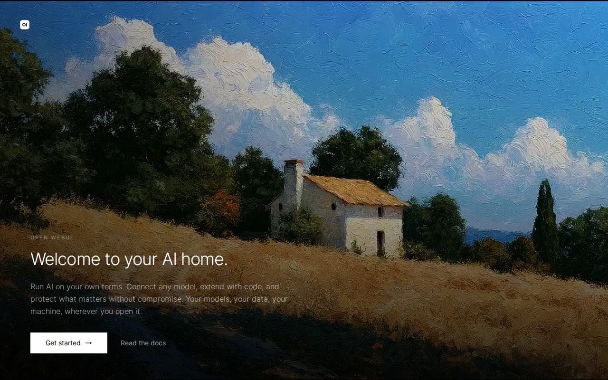

# 📦 Stack Verification Report: Open WebUI & Ollama AI Studio

> **Stack ID:** `open-webui-ollama` | **Status:** ✅ PASSED | **Last Verified:** 2026-09-13 10:52:39

## Overview & Purpose

Integrated sovereign AI chatbot and inference platform combining Open WebUI with the local Ollama LLM engine and LiteLLM unified gateway.

### Test Environment & Parameters
- **Hypervisor / Platform:** Proxmox VE 8.x
- **Execution Target:** `VM` (PODMAN)
- **Host Bridge / Network:** Isolated Subnet (`10.99.0.x`)
- **Services in Stack:** 3 modular containers

## Stack Services Matrix

| Service / Component | Status | Container | HTTP / Web UI | Log Validation | Details |
| :--- | :--- | :--- | :--- | :--- | :--- |
| **Ollama LLM Engine** (`ollama`) | ✅ Ready | Running | N/A | Clean (No errors) | [Inspect](#details-ollama) |
| **Open WebUI** (`open-webui`) | ✅ Ready | Running | OK | Clean (No errors) | [Inspect](#details-open-webui) |
| **LiteLLM AI Gateway** (`litellm`) | ✅ Ready | Running | OK | Clean (No errors) | [Inspect](#details-litellm) |

---

## Detailed Service Inspection & Upstream Guides

Expand each section below to inspect ports, auth protocol, and upstream project links for post-installation configuration.

<details id="details-ollama">
<summary>🔍 <b>Component Inspection: Ollama LLM Engine (<code>ollama</code>)</b></summary>

**Description:** Ollama is an open-source, lightweight, and extensible framework for running Large Language Models (LLMs) locally, such as Llama 3, Qwen, Mistral, and DeepSeek.

#### Upstream Project & Configuration Docs:
- 💡 **Post-Install Guide:** *Background service operating without an independent web interface.*

#### Deployment Runtime Parameters:
- **Port Bindings:** `Host/Standard`
- **Web UI Endpoint:** `Configured dynamically`
- **Onboarding / Auth Protocol:** `none`
- **Volume Mapping:** Isolated Persistent Storage (`/opt/njorddeploy/ollama`)

```yaml
# NjordDeploy verified configuration preview for ollama
service: ollama
status: healthy
restart_policy: unless-stopped
```
</details>

<details id="details-open-webui">
<summary>🔍 <b>Component Inspection: Open WebUI (<code>open-webui</code>)</b></summary>

**Description:** Open WebUI is an extensible, feature-rich, and user-friendly web interface for AI models and LLMs, supporting Ollama and OpenAI-compatible APIs with chat, voice, and RAG capabilities.

#### Upstream Project & Configuration Docs:
- 🌐 **Official Website / Repo:** [https://openwebui.com/](https://openwebui.com/)
- 💡 **Post-Install Guide:** *Open Open WebUI web UI and complete the initial onboarding setup.*

#### Deployment Runtime Parameters:
- **Port Bindings:** `Host/Standard`
- **Web UI Endpoint:** `http://10.99.0.199:3000`
- **Onboarding / Auth Protocol:** `wizard`
- **Volume Mapping:** Isolated Persistent Storage (`/opt/njorddeploy/open-webui`)

#### Web UI Screenshot:



```yaml
# NjordDeploy verified configuration preview for open-webui
service: open-webui
status: healthy
restart_policy: unless-stopped
```
</details>

<details id="details-litellm">
<summary>🔍 <b>Component Inspection: LiteLLM AI Gateway (<code>litellm</code>)</b></summary>

**Description:** LiteLLM is an AI gateway and LLM proxy that unifies access to 100+ Large Language Models (OpenAI, Gemini, Anthropic, Ollama, Azure, Bedrock, HostYourAI) behind a single OpenAI-compatible API format.

#### Upstream Project & Configuration Docs:
- 🌐 **Official Website / Repo:** [https://github.com/BerriAI/litellm](https://github.com/BerriAI/litellm)
- 💡 **Post-Install Guide:** *Open LiteLLM AI Gateway web UI and complete the initial onboarding setup.*

#### Deployment Runtime Parameters:
- **Port Bindings:** `Host/Standard`
- **Web UI Endpoint:** `http://10.99.0.199:4000`
- **Onboarding / Auth Protocol:** `wizard`
- **Volume Mapping:** Isolated Persistent Storage (`/opt/njorddeploy/litellm`)

#### Web UI Screenshot:


```yaml
# NjordDeploy verified configuration preview for litellm
service: litellm
status: healthy
restart_policy: unless-stopped
```
</details>

---

## 🖼️ Verified Web UI Screenshots Gallery

The following live screenshots were automatically captured during the test run:

### Open WebUI (`open-webui`)
- **Endpoint:** [http://10.99.0.199:3000](http://10.99.0.199:3000)


### LiteLLM AI Gateway (`litellm`)
- **Endpoint:** [http://10.99.0.199:4000](http://10.99.0.199:4000)


---
[⬅️ Back to Master Test Dashboard](../LATEST_RUN.md)
