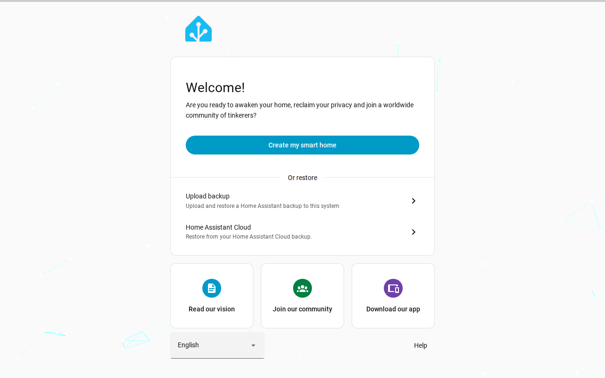
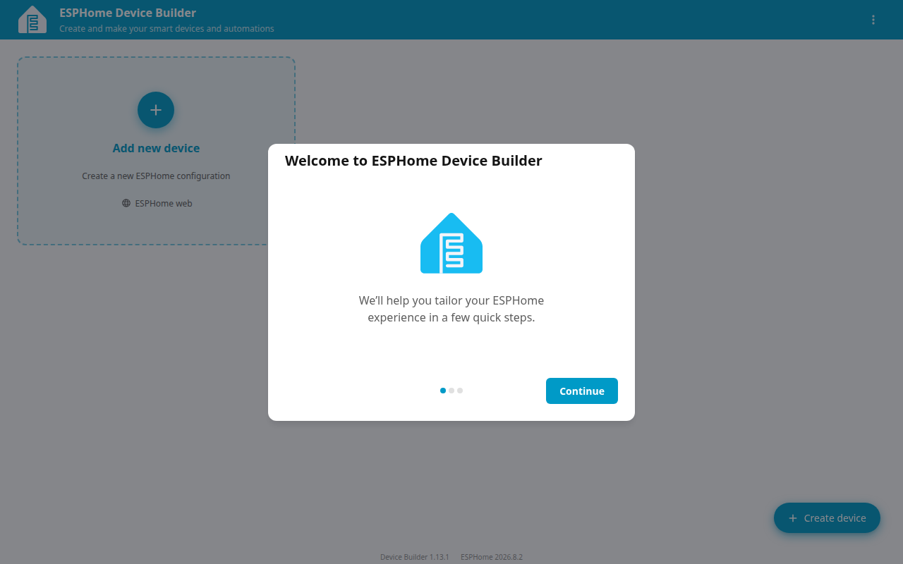
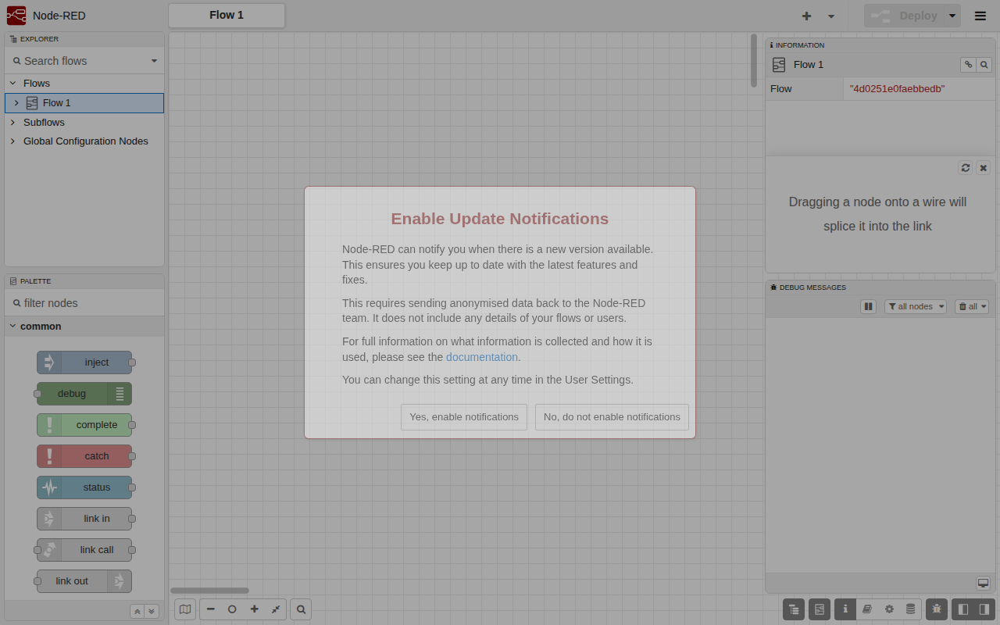
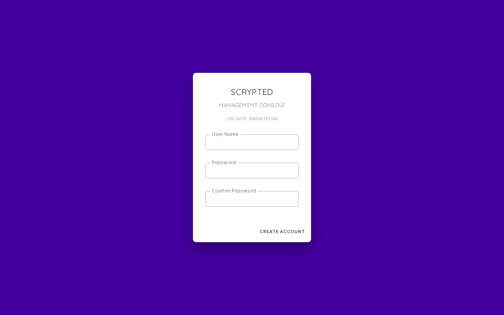

# 📦 Stack Verification Report: Sovereign Smart Home Hub

> **Stack ID:** `smarthome-stack` | **Status:** ✅ PASSED | **Last Verified:** 2026-09-13 10:56:36

## Overview & Purpose

Local home automation workstation combining Home Assistant, ESPHome firmware builder, Node-RED visual logic orchestrator, and Scrypted video integration.

### Test Environment & Parameters
- **Hypervisor / Platform:** Proxmox VE 8.x
- **Execution Target:** `VM` (PODMAN)
- **Host Bridge / Network:** Isolated Subnet (`10.99.0.x`)
- **Services in Stack:** 4 modular containers

## Stack Services Matrix

| Service / Component | Status | Container | HTTP / Web UI | Log Validation | Details |
| :--- | :--- | :--- | :--- | :--- | :--- |
| **Home Assistant** (`homeassistant`) | ✅ Ready | Running | OK | Clean (No errors) | [Inspect](#details-homeassistant) |
| **ESPHome** (`esphome`) | ✅ Ready | Running | OK | Clean (No errors) | [Inspect](#details-esphome) |
| **Node-RED** (`node-red`) | ✅ Ready | Running | OK | Clean (No errors) | [Inspect](#details-node-red) |
| **Scrypted** (`scrypted`) | ✅ Ready | Running | OK | Clean (No errors) | [Inspect](#details-scrypted) |

---

## Detailed Service Inspection & Upstream Guides

Expand each section below to inspect ports, auth protocol, and upstream project links for post-installation configuration.

<details id="details-homeassistant">
<summary>🔍 <b>Component Inspection: Home Assistant (<code>homeassistant</code>)</b></summary>

**Description:** Open source home automation that puts local control and privacy first.

#### Upstream Project & Configuration Docs:
- 🌐 **Official Website / Repo:** [https://www.home-assistant.io/](https://www.home-assistant.io/)
- 📖 **Configuration Manual:** [https://www.home-assistant.io/getting-started/onboarding/](https://www.home-assistant.io/getting-started/onboarding/)
- 💡 **Post-Install Guide:** *Follow the onboarding flow to name your home, set location, and create your owner account.*

#### Deployment Runtime Parameters:
- **Port Bindings:** `Host/Standard`
- **Web UI Endpoint:** `http://10.99.0.199:8123`
- **Onboarding / Auth Protocol:** `wizard`
- **Volume Mapping:** Isolated Persistent Storage (`/opt/njorddeploy/homeassistant`)

#### Web UI Screenshot:



```yaml
# NjordDeploy verified configuration preview for homeassistant
service: homeassistant
status: healthy
restart_policy: unless-stopped
```
</details>

<details id="details-esphome">
<summary>🔍 <b>Component Inspection: ESPHome (<code>esphome</code>)</b></summary>

**Description:** System to control your ESP8266 and ESP32 boards by simple and powerful configuration files and control them remotely.

#### Upstream Project & Configuration Docs:
- 💡 **Post-Install Guide:** *Open ESPHome web UI and complete the initial onboarding setup.*

#### Deployment Runtime Parameters:
- **Port Bindings:** `Host/Standard`
- **Web UI Endpoint:** `http://10.99.0.199:6052`
- **Onboarding / Auth Protocol:** `wizard`
- **Volume Mapping:** Isolated Persistent Storage (`/opt/njorddeploy/esphome`)

#### Web UI Screenshot:



```yaml
# NjordDeploy verified configuration preview for esphome
service: esphome
status: healthy
restart_policy: unless-stopped
```
</details>

<details id="details-node-red">
<summary>🔍 <b>Component Inspection: Node-RED (<code>node-red</code>)</b></summary>

**Description:** Low-code programming for event-driven applications, connecting hardware devices, APIs and online services.

#### Upstream Project & Configuration Docs:
- 💡 **Post-Install Guide:** *Open Node-RED web UI and complete the initial onboarding setup.*

#### Deployment Runtime Parameters:
- **Port Bindings:** `Host/Standard`
- **Web UI Endpoint:** `http://10.99.0.199:1880`
- **Onboarding / Auth Protocol:** `wizard`
- **Volume Mapping:** Isolated Persistent Storage (`/opt/njorddeploy/node-red`)

#### Web UI Screenshot:



```yaml
# NjordDeploy verified configuration preview for node-red
service: node-red
status: healthy
restart_policy: unless-stopped
```
</details>

<details id="details-scrypted">
<summary>🔍 <b>Component Inspection: Scrypted (<code>scrypted</code>)</b></summary>

**Description:** A high-performance smart home video integration platform that bridges IP camera feeds to Apple HomeKit, Google Home, and Alexa with hardware acceleration.

#### Upstream Project & Configuration Docs:
- 🌐 **Official Website / Repo:** [https://www.scrypted.app/](https://www.scrypted.app/)
- 💡 **Post-Install Guide:** *Open Scrypted web UI and complete the initial onboarding setup.*

#### Deployment Runtime Parameters:
- **Port Bindings:** `Host/Standard`
- **Web UI Endpoint:** `https://10.99.0.199:10443`
- **Onboarding / Auth Protocol:** `wizard`
- **Volume Mapping:** Isolated Persistent Storage (`/opt/njorddeploy/scrypted`)

#### Web UI Screenshot:



```yaml
# NjordDeploy verified configuration preview for scrypted
service: scrypted
status: healthy
restart_policy: unless-stopped
```
</details>

---

## 🖼️ Verified Web UI Screenshots Gallery

The following live screenshots were automatically captured during the test run:

### Home Assistant (`homeassistant`)
- **Endpoint:** [http://10.99.0.199:8123](http://10.99.0.199:8123)


### ESPHome (`esphome`)
- **Endpoint:** [http://10.99.0.199:6052](http://10.99.0.199:6052)


### Node-RED (`node-red`)
- **Endpoint:** [http://10.99.0.199:1880](http://10.99.0.199:1880)


### Scrypted (`scrypted`)
- **Endpoint:** [https://10.99.0.199:10443](https://10.99.0.199:10443)


---
[⬅️ Back to Master Test Dashboard](../LATEST_RUN.md)
