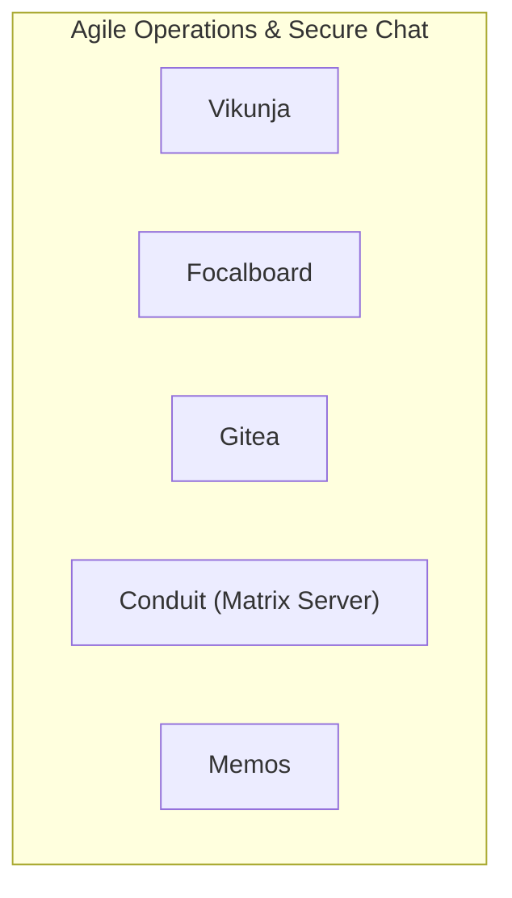

# 📦 NjordDeploy Turnkey Stack: Agile Operations & Secure Chat

> Agile project execution and encrypted collaboration workstation bundling Vikunja task management, Focalboard Kanban sprint boards, Gitea code repository & CI/CD, Conduit lightweight Matrix homeserver, and Memos private notes.

---

## 🧩 Included Components

| Component | Category | Description | Upstream |
|---|---|---|---|
| [`vikunja`](../../component_templates/vikunja/README.md) | Productivity | The to-do app to organize your life with Kanban boards, Gantt charts, lists and table views. | Vikunja |
| [`focalboard`](../../component_templates/focalboard/README.md) | Productivity | Open source, multilingual project management and personal task board alternative to Trello, Notion, and Asana. | Focalboard |
| [`gitea`](../../component_templates/gitea/README.md) | Developer | A painless, self-hosted Git service written in Go with repository management, code review, issues, and wikis. | Gitea |
| [`conduit`](../../component_templates/conduit/README.md) | general | A high-performance, lightweight Matrix chat homeserver written in Rust, specifically optimized for low-resource envir... | [Conduit (Matrix Server)](https://conduit.rs/) |
| [`memos`](../../component_templates/memos/README.md) | Productivity | A privacy-first, lightweight note-taking service with markdown support and social timeline view. | Memos |

---

## 🏗️ Architecture & Topology

---

## ✨ Why this Stack?

- **Zero-Configuration Orchestration:** Every component in this turnkey
  stack is pre-configured to communicate across an isolated internal network.
- **Enterprise-Grade Data Sovereignty:** 100% on-premises deployment
  eliminating dependence on proprietary SaaS ecosystems.
- **Automated Hypervisor Validation:** Every release of this package is
  automatically deployed, health-checked, and validated across 4 Proxmox VE
  matrix quadrants.

---

## 🧪 Verified Quality & Hypervisor Test Report

This turnkey package is verified across 4 hypervisor quadrants (LXC Docker, LXC Podman, VM Docker, VM Podman).
View the full automated execution report in [docs/test-reports/stacks/agile-ops.md](../../docs/test-reports/stacks/agile-ops.md).

---

## 📦 Deploy with NjordDeploy (Recommended)

Deploy the entire **Agile Operations & Secure Chat** bundle with automated secrets generation, reverse proxy configuration, and persistent volume provisioning using the **[NjordDeploy Configurator](https://github.com/HenkVanHoek/njord-deploy)**.
