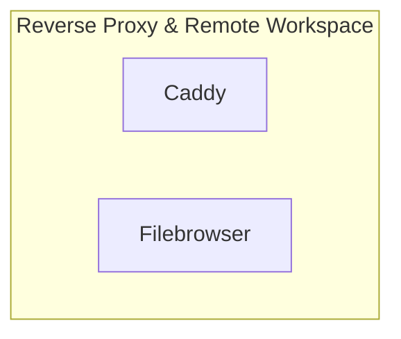

# 📦 NjordDeploy Turnkey Stack: Reverse Proxy & Remote Workspace

> Caddy automated HTTPS reverse proxy paired with FileBrowser for instant web-based file and configuration management.

---

## 🧩 Included Components

| Component | Category | Description | Upstream |
|---|---|---|---|
| [`caddy`](../../component_templates/caddy/README.md) | reverse_proxy | Caddy is a powerful, enterprise-ready, open source web server with automatic HTTPS written in Go. | [Caddy](https://github.com/caddyserver/caddy) |
| [`filebrowser`](../../component_templates/filebrowser/README.md) | System Tools | A lightweight web-based file manager allowing users to upload, edit, delete, preview, and share files on server stora... | [Filebrowser](https://filebrowser.org/) |

---

## 🏗️ Architecture & Topology

---

## ✨ Why this Stack?

- **Zero-Configuration Orchestration:** Every component in this turnkey
  stack is pre-configured to communicate across an isolated internal network.
- **Enterprise-Grade Data Sovereignty:** 100% on-premises deployment
  eliminating dependence on proprietary SaaS ecosystems.
- **Automated Hypervisor Validation:** Every release of this package is
  automatically deployed, health-checked, and validated across 4 Proxmox VE
  matrix quadrants.

---

## 🧪 Verified Quality & Hypervisor Test Report

This turnkey package is verified across 4 hypervisor quadrants (LXC Docker, LXC Podman, VM Docker, VM Podman).
View the full automated execution report in [docs/test-reports/stacks/caddy-filebrowser-stack.md](../../docs/test-reports/stacks/caddy-filebrowser-stack.md).

---

## 📦 Deploy with NjordDeploy (Recommended)

Deploy the entire **Reverse Proxy & Remote Workspace** bundle with automated secrets generation, reverse proxy configuration, and persistent volume provisioning using the **[NjordDeploy Configurator](https://github.com/HenkVanHoek/njord-deploy)**.
