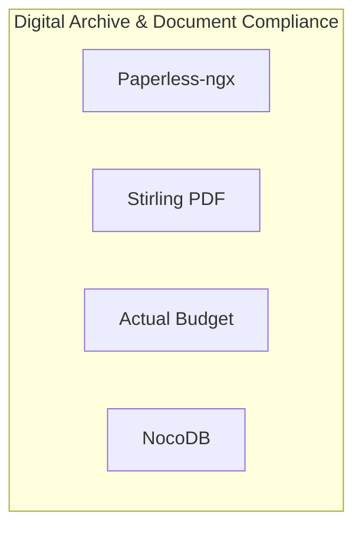

# 📦 NjordDeploy Turnkey Stack: Digital Archive & Document Compliance

> Paperless office and compliance workstation bundling Paperless-ngx automated OCR document scanning, Stirling-PDF sovereign web PDF utility, Actual Budget financial tracking, and NocoDB relational database.

---

## 🧩 Included Components

| Component | Category | Description | Upstream |
|---|---|---|---|
| [`paperless-ngx`](../../component_templates/paperless-ngx/README.md) | Productivity | A document management system that transforms your physical documents into a searchable online archive so you can keep... | Paperless-ngx |
| [`stirling-pdf`](../../component_templates/stirling-pdf/README.md) | Productivity | A powerful, open-source PDF editing platform for editing, signing, redacting, converting, and automating PDFs. | [Stirling PDF](https://stirlingpdf.com/) |
| [`actual-budget`](../../component_templates/actual-budget/README.md) | Productivity | Privacy-first personal finance and envelope budgeting app. It is 100% free and open-source, written in NodeJS, it has... | Actual Budget |
| [`nocodb`](../../component_templates/nocodb/README.md) | Developer | Open Source Airtable Alternative that turns any SQL database into a smart spreadsheet. | NocoDB |

---

## 🏗️ Architecture & Topology

---

## ✨ Why this Stack?

- **Zero-Configuration Orchestration:** Every component in this turnkey
  stack is pre-configured to communicate across an isolated internal network.
- **Enterprise-Grade Data Sovereignty:** 100% on-premises deployment
  eliminating dependence on proprietary SaaS ecosystems.
- **Automated Hypervisor Validation:** Every release of this package is
  automatically deployed, health-checked, and validated across 4 Proxmox VE
  matrix quadrants.

---

## 🧪 Verified Quality & Hypervisor Test Report

This turnkey package is verified across 4 hypervisor quadrants (LXC Docker, LXC Podman, VM Docker, VM Podman).
View the full automated execution report in [docs/test-reports/stacks/digital-archive.md](../../docs/test-reports/stacks/digital-archive.md).

---

## 📦 Deploy with NjordDeploy (Recommended)

Deploy the entire **Digital Archive & Document Compliance** bundle with automated secrets generation, reverse proxy configuration, and persistent volume provisioning using the **[NjordDeploy Configurator](https://github.com/HenkVanHoek/njord-deploy)**.
