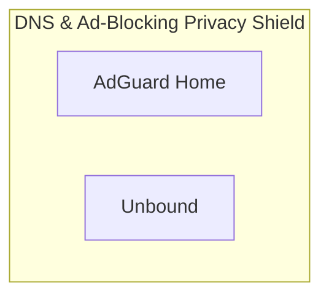

# 📦 NjordDeploy Turnkey Stack: DNS & Ad-Blocking Privacy Shield

> Network-wide privacy barrier bundling AdGuard Home DNS sinkhole with Unbound recursive DNS resolver for zero-ISP tracking.

---

## 🧩 Included Components

| Component | Category | Description | Upstream |
|---|---|---|---|
| [`adguard-home`](../../component_templates/adguard-home/README.md) | dns_blocker | AdGuard Home is a free and open-source network-wide software for blocking ads and tracking. It operates as a DNS serv... | [AdGuard Home](https://adguard.com/en/adguard-home/overview.html) |
| [`unbound`](../../component_templates/unbound/README.md) | Security & Utilities | A secure, validating, recursive, and caching DNS resolver designed for privacy, preventing upstream ISP DNS logging w... | [Unbound](https://www.nlnetlabs.nl/projects/unbound/about/) |

---

## 🏗️ Architecture & Topology

---

## ✨ Why this Stack?

- **Zero-Configuration Orchestration:** Every component in this turnkey
  stack is pre-configured to communicate across an isolated internal network.
- **Enterprise-Grade Data Sovereignty:** 100% on-premises deployment
  eliminating dependence on proprietary SaaS ecosystems.
- **Automated Hypervisor Validation:** Every release of this package is
  automatically deployed, health-checked, and validated across 4 Proxmox VE
  matrix quadrants.

---

## 🧪 Verified Quality & Hypervisor Test Report

This turnkey package is verified across 4 hypervisor quadrants (LXC Docker, LXC Podman, VM Docker, VM Podman).
View the full automated execution report in [docs/test-reports/stacks/dns-shield-stack.md](../../docs/test-reports/stacks/dns-shield-stack.md).

---

## 📦 Deploy with NjordDeploy (Recommended)

Deploy the entire **DNS & Ad-Blocking Privacy Shield** bundle with automated secrets generation, reverse proxy configuration, and persistent volume provisioning using the **[NjordDeploy Configurator](https://github.com/HenkVanHoek/njord-deploy)**.
