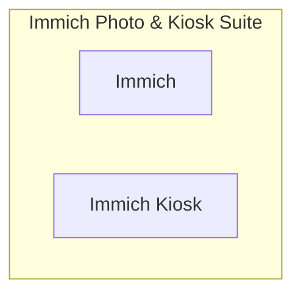

# 📦 NjordDeploy Turnkey Stack: Immich Photo & Kiosk Suite

> Sovereign AI-powered photo and video management with Immich, paired with Immich Kiosk for ambient digital photo frame slideshows on smart TVs and tablets.

---

## 🧩 Included Components

| Component | Category | Description | Upstream |
|---|---|---|---|
| [`immich`](../../component_templates/immich/README.md) | Media Servers | Immich is a high-performance self-hosted photo and video management solution. It consists of multiple services (serve... | Immich |
| [`immich-kiosk`](../../component_templates/immich-kiosk/README.md) | Media Servers | Immich Kiosk is an ambient digital photo frame and slideshow client designed for smart TVs, tablets, and wall display... | [Immich Kiosk](https://github.com/damongolding/immich-kiosk) |

---

## 🏗️ Architecture & Topology

---

## ✨ Why this Stack?

- **Zero-Configuration Orchestration:** Every component in this turnkey
  stack is pre-configured to communicate across an isolated internal network.
- **Enterprise-Grade Data Sovereignty:** 100% on-premises deployment
  eliminating dependence on proprietary SaaS ecosystems.
- **Automated Hypervisor Validation:** Every release of this package is
  automatically deployed, health-checked, and validated across 4 Proxmox VE
  matrix quadrants.

---

## 🧪 Verified Quality & Hypervisor Test Report

This turnkey package is verified across 4 hypervisor quadrants (LXC Docker, LXC Podman, VM Docker, VM Podman).
View the full automated execution report in [docs/test-reports/stacks/immich-stack.md](../../docs/test-reports/stacks/immich-stack.md).

---

## 📦 Deploy with NjordDeploy (Recommended)

Deploy the entire **Immich Photo & Kiosk Suite** bundle with automated secrets generation, reverse proxy configuration, and persistent volume provisioning using the **[NjordDeploy Configurator](https://github.com/HenkVanHoek/njord-deploy)**.
