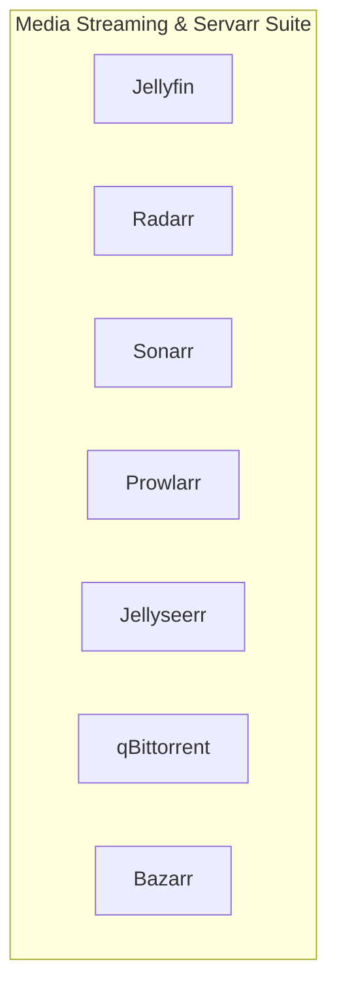

# 📦 NjordDeploy Turnkey Stack: Media Streaming & Servarr Suite

> Unified sovereign media streaming pipeline bundling Jellyfin media server, Radarr (movies), Sonarr (TV shows), Prowlarr (indexer proxy), Jellyseerr (requests), qBittorrent, and Bazarr (subtitles).

---

## 🧩 Included Components

| Component | Category | Description | Upstream |
|---|---|---|---|
| [`jellyfin`](../../component_templates/jellyfin/README.md) | Media Stack | A Free Software Media System that puts you in control of your media. | [Jellyfin](https://jellyfin.org/) |
| [`radarr`](../../component_templates/radarr/README.md) | Media Stack | An automated movie collection manager and PVR that monitors RSS feeds for new releases, triggers download clients, an... | [Radarr](https://radarr.video/) |
| [`sonarr`](../../component_templates/sonarr/README.md) | Media Stack | An automated TV series collection manager and PVR that tracks upcoming episodes, triggers downloads via Usenet or Bit... | [Sonarr](https://sonarr.tv/) |
| [`prowlarr`](../../component_templates/prowlarr/README.md) | Media Stack | Prowlarr is an indexer manager/proxy built on the popular *arr .net/reactjs base stack to integrate with your various... | [Prowlarr](https://prowlarr.com/) |
| [`jellyseerr`](../../component_templates/jellyseerr/README.md) | Media | Free and open source software application for managing requests for your media library (Jellyfin, Emby, Plex). | Jellyseerr |
| [`qbittorrent`](../../component_templates/qbittorrent/README.md) | Media Stack | A lightweight, open-source BitTorrent download client featuring a full-featured web interface, bandwidth scheduling, ... | [qBittorrent](https://www.qbittorrent.org/) |
| [`bazarr`](../../component_templates/bazarr/README.md) | Media | Companion application to Sonarr and Radarr that manages and downloads subtitles based on your requirements. | Bazarr |

---

## 🏗️ Architecture & Topology

---

## ✨ Why this Stack?

- **Zero-Configuration Orchestration:** Every component in this turnkey
  stack is pre-configured to communicate across an isolated internal network.
- **Enterprise-Grade Data Sovereignty:** 100% on-premises deployment
  eliminating dependence on proprietary SaaS ecosystems.
- **Automated Hypervisor Validation:** Every release of this package is
  automatically deployed, health-checked, and validated across 4 Proxmox VE
  matrix quadrants.

---

## 🧪 Verified Quality & Hypervisor Test Report

This turnkey package is verified across 4 hypervisor quadrants (LXC Docker, LXC Podman, VM Docker, VM Podman).
View the full automated execution report in [docs/test-reports/stacks/media-stack.md](../../docs/test-reports/stacks/media-stack.md).

---

## 📦 Deploy with NjordDeploy (Recommended)

Deploy the entire **Media Streaming & Servarr Suite** bundle with automated secrets generation, reverse proxy configuration, and persistent volume provisioning using the **[NjordDeploy Configurator](https://github.com/HenkVanHoek/njord-deploy)**.
