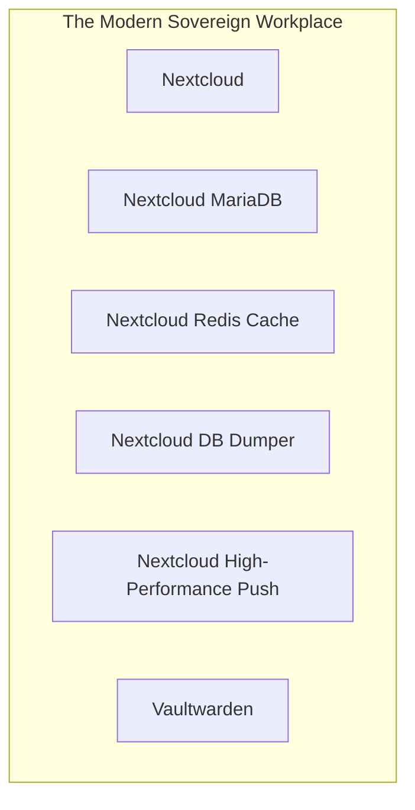

# 📦 NjordDeploy Turnkey Stack: The Modern Sovereign Workplace

> Turnkey Microsoft 365 & Google Workspace alternative bundling enterprise Nextcloud Hub, dedicated MariaDB, Redis cache, automated database dumper, high-performance push notifications, and Vaultwarden centralized password management.

---

## 🧩 Included Components

| Component | Category | Description | Upstream |
|---|---|---|---|
| [`nextcloud`](../../component_templates/nextcloud/README.md) | Productivity | A comprehensive self-hosted productivity and collaboration suite offering secure file storage, online document editin... | [Nextcloud](https://nextcloud.com/) |
| [`nextcloud-db`](../../component_templates/nextcloud-db/README.md) | databases | A dedicated, pre-configured MariaDB relational database server optimized for Nextcloud persistent data storage and hi... | Nextcloud MariaDB |
| [`nextcloud-redis`](../../component_templates/nextcloud-redis/README.md) | utilities | An in-memory Redis datastore configured as a high-performance transactional file locking broker and caching layer for... | Nextcloud Redis Cache |
| [`nextcloud-db-dumper`](../../component_templates/nextcloud-db-dumper/README.md) | databases | An automated backup utility container that periodically exports SQL dumps of the Nextcloud MariaDB database for disas... | Nextcloud DB Dumper |
| [`notify-push`](../../component_templates/notify-push/README.md) | utilities | Realtime notification and file-sync daemon for Nextcloud written in Rust. | Nextcloud High-Performance Push |
| [`vaultwarden`](../../component_templates/vaultwarden/README.md) | Security & Utilities | A lightweight, self-hosted password manager compatible with Bitwarden clients. It provides almost all of the features... | [Vaultwarden](https://github.com/dani-garcia/vaultwarden) |

---

## 🏗️ Architecture & Topology

---

## ✨ Why this Stack?

- **Zero-Configuration Orchestration:** Every component in this turnkey
  stack is pre-configured to communicate across an isolated internal network.
- **Enterprise-Grade Data Sovereignty:** 100% on-premises deployment
  eliminating dependence on proprietary SaaS ecosystems.
- **Automated Hypervisor Validation:** Every release of this package is
  automatically deployed, health-checked, and validated across 4 Proxmox VE
  matrix quadrants.

---

## 🧪 Verified Quality & Hypervisor Test Report

This turnkey package is verified across 4 hypervisor quadrants (LXC Docker, LXC Podman, VM Docker, VM Podman).
View the full automated execution report in [docs/test-reports/stacks/modern-workplace.md](../../docs/test-reports/stacks/modern-workplace.md).

---

## 📦 Deploy with NjordDeploy (Recommended)

Deploy the entire **The Modern Sovereign Workplace** bundle with automated secrets generation, reverse proxy configuration, and persistent volume provisioning using the **[NjordDeploy Configurator](https://github.com/HenkVanHoek/njord-deploy)**.
