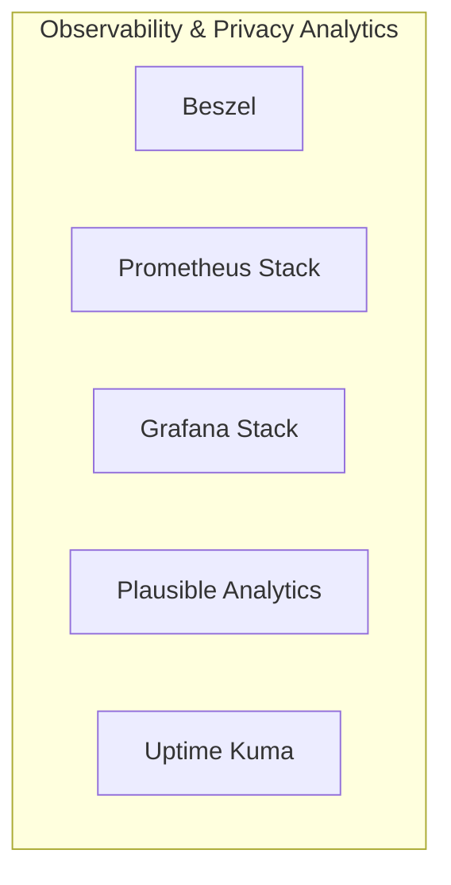

# 📦 NjordDeploy Turnkey Stack: Observability & Privacy Analytics

> Full-stack server fleet observability and GDPR-compliant website analytics bundling Beszel lightweight metrics, Prometheus time-series collector, Grafana visualization dashboards, Plausible cookie-less web analytics, and Uptime Kuma status monitors.

---

## 🧩 Included Components

| Component | Category | Description | Upstream |
|---|---|---|---|
| [`beszel`](../../component_templates/beszel/README.md) | Monitoring | Lightweight server monitoring hub with historical resource metrics and alerts. | Beszel |
| [`prometheus`](../../component_templates/prometheus/README.md) | System Tools | Prometheus, a Cloud Native Computing Foundation project, is a systems and service monitoring system. It collects metr... | [Prometheus Stack](https://prometheus.io/) |
| [`grafana`](../../component_templates/grafana/README.md) | System Tools | An open-source visualization and analytics platform that turns metrics and logs into dynamic, interactive dashboards ... | [Grafana Stack](https://grafana.com/) |
| [`plausible`](../../component_templates/plausible/README.md) | Utilities | Plausible is a lightweight, open-source and privacy-friendly Google Analytics alternative without cookies and fully c... | [Plausible Analytics](https://plausible.io/) |
| [`uptime-kuma`](../../component_templates/uptime-kuma/README.md) | System Tools | A feature-rich, self-hosted monitoring tool providing real-time status pages, HTTP/ping health checks, and alerts via... | [Uptime Kuma](https://uptime.kuma.pet/) |

---

## 🏗️ Architecture & Topology

---

## ✨ Why this Stack?

- **Zero-Configuration Orchestration:** Every component in this turnkey
  stack is pre-configured to communicate across an isolated internal network.
- **Enterprise-Grade Data Sovereignty:** 100% on-premises deployment
  eliminating dependence on proprietary SaaS ecosystems.
- **Automated Hypervisor Validation:** Every release of this package is
  automatically deployed, health-checked, and validated across 4 Proxmox VE
  matrix quadrants.

---

## 🧪 Verified Quality & Hypervisor Test Report

This turnkey package is verified across 4 hypervisor quadrants (LXC Docker, LXC Podman, VM Docker, VM Podman).
View the full automated execution report in [docs/test-reports/stacks/observability-analytics.md](../../docs/test-reports/stacks/observability-analytics.md).

---

## 📦 Deploy with NjordDeploy (Recommended)

Deploy the entire **Observability & Privacy Analytics** bundle with automated secrets generation, reverse proxy configuration, and persistent volume provisioning using the **[NjordDeploy Configurator](https://github.com/HenkVanHoek/njord-deploy)**.
