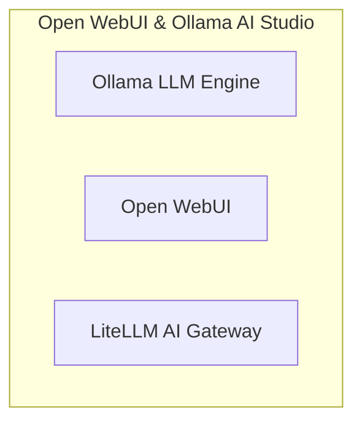

# 📦 NjordDeploy Turnkey Stack: Open WebUI & Ollama AI Studio

> Integrated sovereign AI chatbot and inference platform combining Open WebUI with the local Ollama LLM engine and LiteLLM unified gateway.

---

## 🧩 Included Components

| Component | Category | Description | Upstream |
|---|---|---|---|
| [`ollama`](../../component_templates/ollama/README.md) | AI & LLM Services | Ollama is an open-source, lightweight, and extensible framework for running Large Language Models (LLMs) locally, suc... | Ollama LLM Engine |
| [`open-webui`](../../component_templates/open-webui/README.md) | AI & LLM Services | Open WebUI is an extensible, feature-rich, and user-friendly web interface for AI models and LLMs, supporting Ollama ... | [Open WebUI](https://openwebui.com/) |
| [`litellm`](../../component_templates/litellm/README.md) | AI & LLM Services | LiteLLM is an AI gateway and LLM proxy that unifies access to 100+ Large Language Models (OpenAI, Gemini, Anthropic, ... | [LiteLLM AI Gateway](https://github.com/BerriAI/litellm) |

---

## 🏗️ Architecture & Topology

---

## ✨ Why this Stack?

- **Zero-Configuration Orchestration:** Every component in this turnkey
  stack is pre-configured to communicate across an isolated internal network.
- **Enterprise-Grade Data Sovereignty:** 100% on-premises deployment
  eliminating dependence on proprietary SaaS ecosystems.
- **Automated Hypervisor Validation:** Every release of this package is
  automatically deployed, health-checked, and validated across 4 Proxmox VE
  matrix quadrants.

---

## 🧪 Verified Quality & Hypervisor Test Report

This turnkey package is verified across 4 hypervisor quadrants (LXC Docker, LXC Podman, VM Docker, VM Podman).
View the full automated execution report in [docs/test-reports/stacks/open-webui-ollama.md](../../docs/test-reports/stacks/open-webui-ollama.md).

---

## 📦 Deploy with NjordDeploy (Recommended)

Deploy the entire **Open WebUI & Ollama AI Studio** bundle with automated secrets generation, reverse proxy configuration, and persistent volume provisioning using the **[NjordDeploy Configurator](https://github.com/HenkVanHoek/njord-deploy)**.
