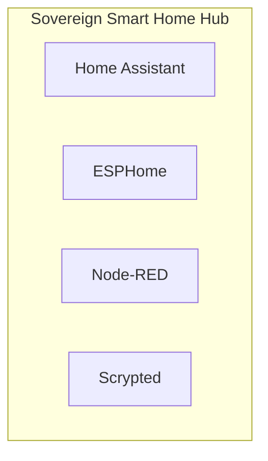

# 📦 NjordDeploy Turnkey Stack: Sovereign Smart Home Hub

> Local home automation workstation combining Home Assistant, ESPHome firmware builder, Node-RED visual logic orchestrator, and Scrypted video integration.

---

## 🧩 Included Components

| Component | Category | Description | Upstream |
|---|---|---|---|
| [`homeassistant`](../../component_templates/homeassistant/README.md) | Smart Home & IoT | Open source home automation that puts local control and privacy first. | [Home Assistant](https://www.home-assistant.io/) |
| [`esphome`](../../component_templates/esphome/README.md) | Smart Home | System to control your ESP8266 and ESP32 boards by simple and powerful configuration files and control them remotely. | ESPHome |
| [`node-red`](../../component_templates/node-red/README.md) | Smart Home | Low-code programming for event-driven applications, connecting hardware devices, APIs and online services. | Node-RED |
| [`scrypted`](../../component_templates/scrypted/README.md) | Smart Home & IoT | A high-performance smart home video integration platform that bridges IP camera feeds to Apple HomeKit, Google Home, ... | [Scrypted](https://www.scrypted.app/) |

---

## 🏗️ Architecture & Topology

---

## ✨ Why this Stack?

- **Zero-Configuration Orchestration:** Every component in this turnkey
  stack is pre-configured to communicate across an isolated internal network.
- **Enterprise-Grade Data Sovereignty:** 100% on-premises deployment
  eliminating dependence on proprietary SaaS ecosystems.
- **Automated Hypervisor Validation:** Every release of this package is
  automatically deployed, health-checked, and validated across 4 Proxmox VE
  matrix quadrants.

---

## 🧪 Verified Quality & Hypervisor Test Report

This turnkey package is verified across 4 hypervisor quadrants (LXC Docker, LXC Podman, VM Docker, VM Podman).
View the full automated execution report in [docs/test-reports/stacks/smarthome-stack.md](../../docs/test-reports/stacks/smarthome-stack.md).

---

## 📦 Deploy with NjordDeploy (Recommended)

Deploy the entire **Sovereign Smart Home Hub** bundle with automated secrets generation, reverse proxy configuration, and persistent volume provisioning using the **[NjordDeploy Configurator](https://github.com/HenkVanHoek/njord-deploy)**.
